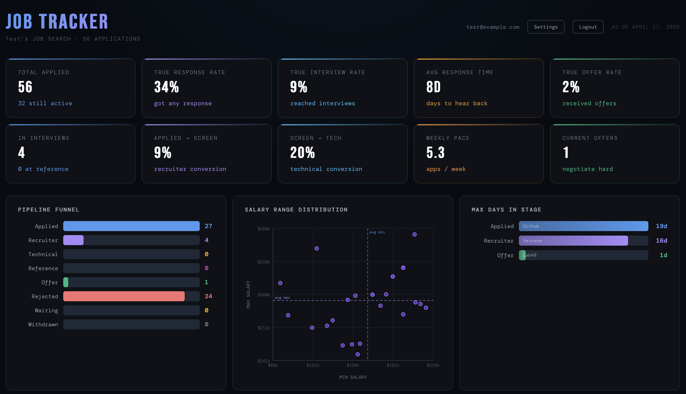
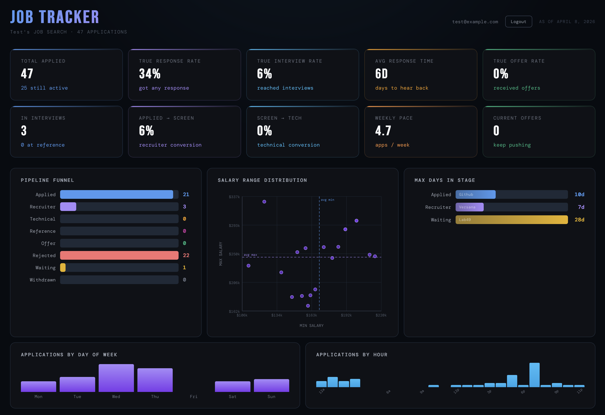
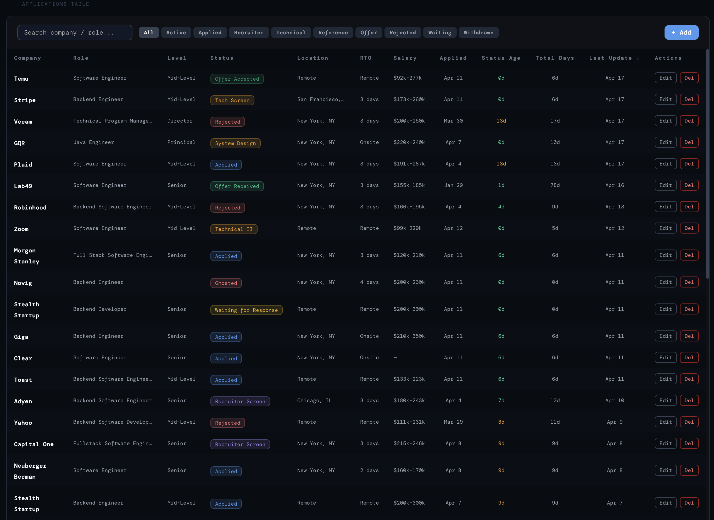

# Job Tracker

A full-stack job application tracking system — a React frontend and a Spring Boot REST API — with JWT authentication and a detailed analytics dashboard for your job search.







## Features

### Tracking

- **Job application management** — full CRUD over applications, with company, position, location, salary range, and remote/hybrid/onsite (RTO) type
- **18 pipeline statuses** — from `APPLIED` through screens, technical rounds, and `REFERENCE_CHECK` to offer, rejection, withdrawal, or `GHOSTED`
- **Audit trail** — every status change is recorded and viewable as a per-application journey timeline
- **User isolation** — each account can only read and write its own applications

### Analytics

The dashboard is built from a set of independently toggleable views:

- **Stat cards and stage funnel** — counts by status and conversion through the pipeline
- **Salary range chart** — compensation distribution across your applications
- **Time-in-stage and max-time-per-stage** — where applications stall
- **Activity heatmap** — application activity over the calendar
- **Day-of-week and hour distribution** — when you actually apply
- **Company, location, and position insights** — outcome breakdowns by dimension
- **Status transition heatmap** — how applications move between stages
- **Funnel analytics and application health** — deeper pipeline diagnostics (off by default; enable in dashboard settings)

Every chart is hand-rolled SVG/CSS — the frontend ships **no charting library**.

### Application

- **JWT authentication** — registration and login with role-based access
- **Dashboard settings** — show/hide any dashboard component; preferences persist in `localStorage`
- **Keyboard shortcuts** — press <kbd>?</kbd> anywhere for the shortcut reference
- **Seeded demo account** — a test user with sample applications is created on first startup
- **OpenAPI docs** — Swagger UI served by the backend

## Tech Stack

### Backend

- **Java 17**, **Spring Boot 3.4.5**
- **Spring Security** with JWT (jjwt 0.12.5)
- **Spring Data JPA** / Hibernate, **MySQL 8**
- **Maven** build, **SpringDoc OpenAPI** docs, **Spring Boot Actuator**
- Clean/hexagonal layering: `domain` → `application` → `infrastructure`
- **JUnit 5**, **Mockito**, **Spring Security Test**; **JaCoCo** enforces 85% line coverage

### Frontend

- **React 18** on Create React App (react-scripts 5)
- **React Router 6**, **Axios** with auth interceptors
- Context API for auth and keyboard-shortcut state
- **Jest** + **React Testing Library** + **jest-axe** for accessibility assertions

## Getting Started

### Option 1: Docker Compose (recommended)

Brings up MySQL, the backend, and the frontend together. Requires only Docker.

```bash
git clone https://github.com/Jnolcox/job-tracker.git
cd job-tracker

cp .env.example .env      # then edit .env — see the security note below
docker compose up --build
```

Once the containers report healthy:

| Service | URL |
| --- | --- |
| Frontend | http://localhost:3000 |
| Backend API | http://localhost:8080/api |
| Swagger UI | http://localhost:8080/api/swagger-ui.html |
| OpenAPI spec | http://localhost:8080/api/api-docs |
| Health check | http://localhost:8080/api/actuator/health |

Tear down with `docker compose down`, or `docker compose down -v` to also drop the database volume.

> **Security note:** `.env.example` ships a placeholder `JWT_SECRET` purely so the stack starts out of the box. Before running anywhere other than your own machine, replace it:
>
> ```bash
> openssl rand -hex 32
> ```
>
> and change the MySQL passwords as well.

### Option 2: Local development

**Prerequisites:** Java 17+, Maven 3.6+, Node.js 18+ (the Docker build uses Node 22), and a running MySQL 8.

The backend expects a MySQL database matching the defaults in `src/main/resources/application.yml`:

```sql
CREATE DATABASE job_tracking_db;
CREATE USER 'jobtracker'@'localhost' IDENTIFIED BY 'jobtracker123';
GRANT ALL PRIVILEGES ON job_tracking_db.* TO 'jobtracker'@'localhost';
```

Hibernate creates the schema on startup (`ddl-auto: update`). If you'd rather start from the checked-in schema, load `src/main/resources/database/job_tracking_db_1.sql`.

Start the backend:

```bash
mvn spring-boot:run
```

Start the frontend in a second terminal:

```bash
cd frontend
npm install
npm start
```

The frontend dev server runs on http://localhost:3000 and proxies API calls to the backend on port 8080.

### Demo credentials

On first startup the backend seeds a test user with 5 sample applications across different statuses:

- **Email:** `test@example.com`
- **Password:** `password123`

Seeding is skipped under the `test` profile. Remove `DataInitializer` or disable the seed before any real deployment.

## API Overview

All routes are served under the `/api` context path.

| Method | Endpoint | Description |
| --- | --- | --- |
| `POST` | `/v1/auth/register` | Create an account |
| `POST` | `/v1/auth/login` | Exchange credentials for a JWT |
| `GET` `POST` | `/v1/job-applications` | List (paginated) and create applications |
| `GET` `PUT` `DELETE` | `/v1/job-applications/{id}` | Read, update, delete one application |
| `GET` | `/v1/job-applications/{id}/events` | Audit trail for one application |
| `GET` | `/v1/job-applications/events/all` | Audit trail across all applications |
| `GET` | `/v1/job-applications/metrics` | Headline metrics |
| `GET` | `/v1/job-applications/counts-by-status` | Counts per status |
| `GET` | `/v1/job-applications/analytics/*` | Salary distribution, activity heatmap, time patterns, stage durations, transition matrix, funnel, health, and company/location/position insights |
| `GET` | `/v1/config/statuses`, `/v1/config/options` | Enum and dropdown metadata for the UI |

Swagger UI at `/api/swagger-ui.html` documents request and response shapes for all of the above.

## Testing

Backend — runs the suite and enforces the JaCoCo coverage gate:

```bash
mvn verify
```

The coverage report lands in `target/site/jacoco/index.html`.

Frontend:

```bash
cd frontend
CI=true npm test -- --watchAll=false
```

Both suites must pass before a change is merged.

## Configuration

Environment variables read by the backend (defaults in parentheses):

| Variable | Description |
| --- | --- |
| `SPRING_DATASOURCE_URL` | JDBC URL (docker profile: the `mysql` service) |
| `SPRING_DATASOURCE_USERNAME` / `_PASSWORD` | Database credentials (`jobtracker` / `jobtracker123`) |
| `JWT_SECRET` | HMAC signing key — **override this** |
| `JWT_EXPIRATION` | Token lifetime in ms (30 days locally, 1 day under Docker) |
| `CORS_ALLOWED_ORIGINS` | Comma-separated allowed origins (`http://localhost:3000`) |

The `docker` Spring profile (`application-docker.yml`) tightens logging, adds a Hikari pool, and exposes only the `health` and `info` actuator endpoints.

## Project Structure

```
├── src/main/java/com/nolcox/jobtracking/
│   ├── application/      # controllers, DTOs, services
│   ├── domain/           # entities and repositories
│   ├── infrastructure/   # security and JWT
│   ├── common/           # shared constants
│   └── config/           # security, OpenAPI, data seeding
├── src/test/java/        # unit and integration tests
├── frontend/src/
│   ├── components/       # charts, modals, table, settings
│   ├── hooks/            # analytics, settings, keyboard shortcuts
│   ├── services/         # API client
│   ├── constants/        # statuses, colors, dashboard config
│   └── context/          # auth and shortcut providers
├── docker-compose.yml
└── Dockerfile            # backend image (frontend/Dockerfile builds the UI)
```

## Contributing

Issues and pull requests are welcome. Please make sure `mvn verify` and the frontend test suite both pass, and keep new code covered — the 85% line-coverage gate is enforced at build time.

## License

Released under the MIT License. See [LICENSE](LICENSE).
