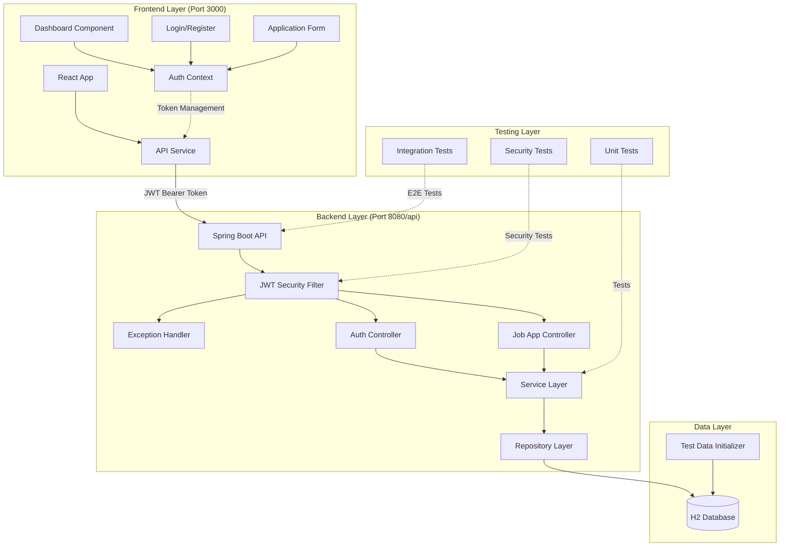
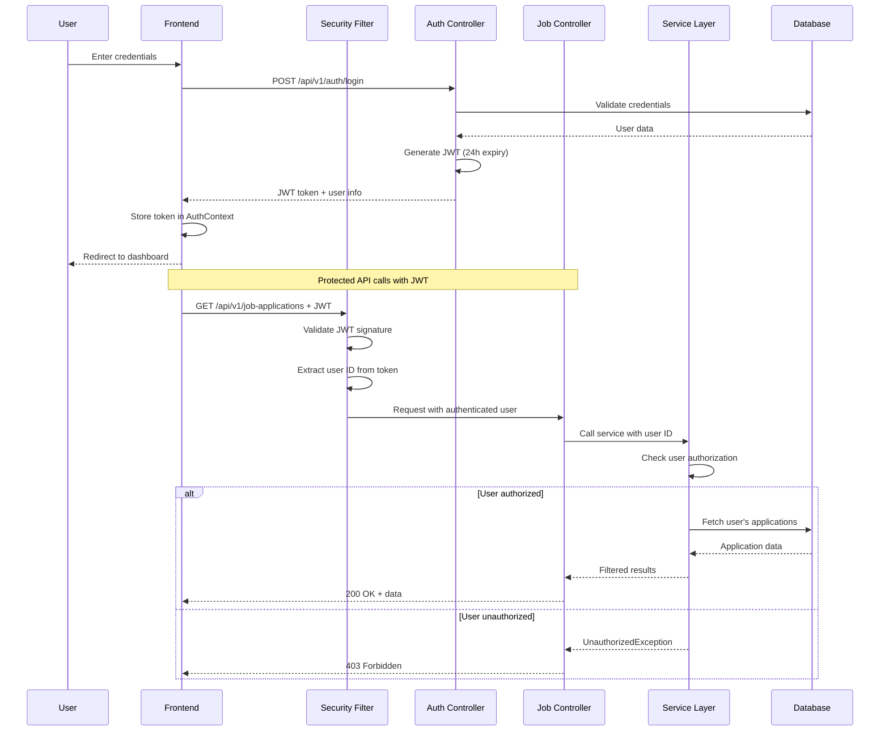
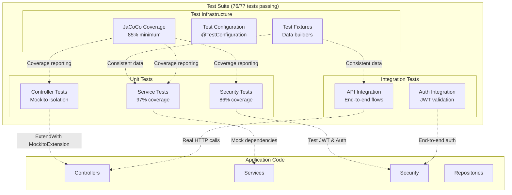
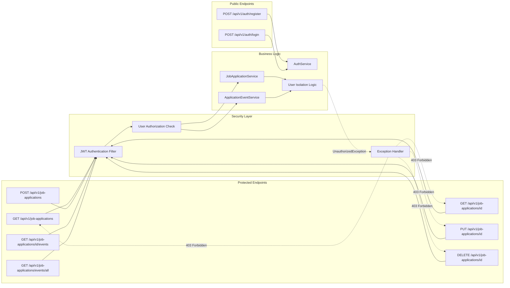
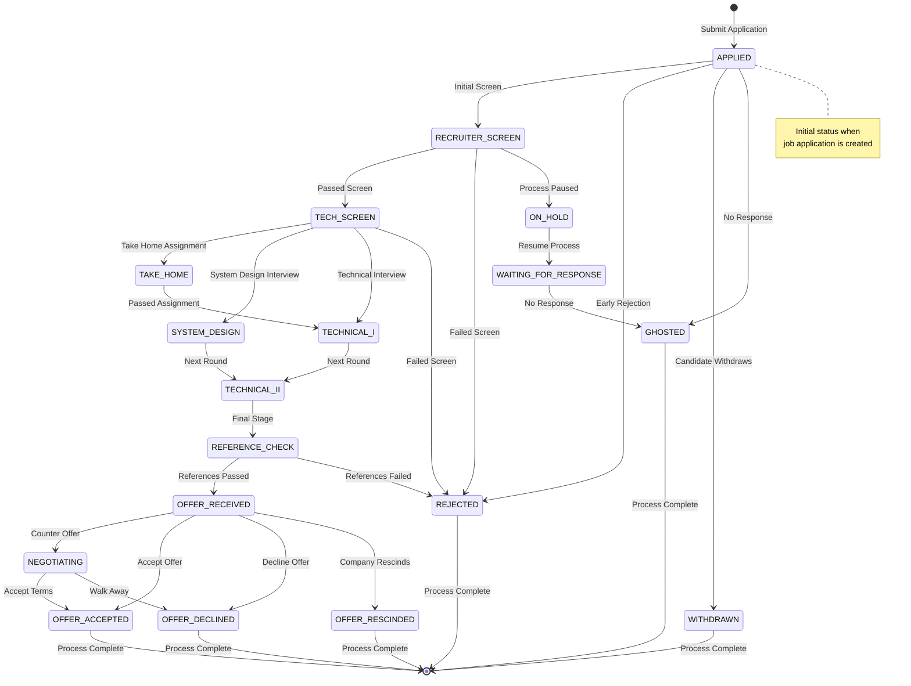

A full-stack job application tracking system with React frontend and Spring Boot backend, featuring JWT-based authentication and comprehensive job application management.

## Features

- **Full-Stack Architecture**: React frontend with Spring Boot REST API backend
- **User Authentication**: Secure JWT-based authentication system with role-based access
- **Job Application Management**: Complete CRUD operations for tracking job applications
- **Status Tracking**: Monitor application progress through various stages
- **User Isolation**: Each user can only access their own job applications
- **Dashboard Analytics**: Statistics and insights for application tracking
- **Responsive UI**: Modern React interface with professional styling
- **Default Test User**: Pre-configured test credentials for easy development/testing
- **API Documentation**: Integrated Swagger UI for API exploration

## Tech Stack

### Backend
- **Language**: Java 17
- **Framework**: Spring Boot 3.4.5
- **Security**: Spring Security with JWT (jjwt 0.12.5)
- **Database**: H2 (development) / MySQL 8.3.0 (production)
- **Build Tool**: Maven
- **Architecture**: Clean/Hexagonal Architecture
- **Documentation**: SpringDoc OpenAPI
- **Testing**: JUnit 5, Mockito, TestContainers

### Frontend
- **Framework**: React 18.2
- **Routing**: React Router DOM
- **HTTP Client**: Axios with interceptors
- **Styling**: CSS3 with responsive design
- **Authentication**: Context API for state management
- **Build Tool**: Create React App

## Architecture Diagrams

### System Architecture


### Authentication & Security Flow


### Testing Architecture


### API Endpoint Architecture


### Application Status Flow


## Project Structure

```
jobtracking/
├── frontend/                        # React frontend application
│   ├── public/
│   │   └── index.html              # HTML template
│   ├── src/
│   │   ├── components/             # React components
│   │   │   ├── ActivityHeatmap.jsx # Activity visualization
│   │   │   ├── charts/            # Chart components
│   │   │   ├── common/            # Shared UI components
│   │   │   ├── modal/             # Modal components
│   │   │   ├── table/             # Table components
│   │   │   ├── Home.js            # Home page
│   │   │   ├── Login.js           # Login form
│   │   │   ├── Register.js        # User registration
│   │   │   ├── ProtectedRoute.js  # Route protection
│   │   │   └── KeyboardShortcutHelp.js  # Keyboard shortcuts
│   │   ├── context/
│   │   │   ├── AuthContext.js     # Authentication state management
│   │   │   └── KeyboardShortcutContext.js  # Keyboard shortcuts
│   │   ├── constants/             # Application constants
│   │   ├── hooks/                 # Custom React hooks
│   │   ├── services/
│   │   │   └── api.js             # Axios HTTP client
│   │   ├── utils/                 # Utility functions
│   │   ├── App.js                 # Main app component
│   │   ├── Dashboard.jsx          # Main dashboard with stats
│   │   ├── index.js               # React entry point
│   │   └── index.css              # Global styles
│   ├── package.json               # Dependencies and scripts
│   └── README.md                  # Frontend documentation
├── src/main/java/com/nolcox/jobtracking/
│   ├── application/              # Application layer
│   │   ├── controller/          # REST endpoints
│   │   │   ├── AuthController.java
│   │   │   ├── JobApplicationController.java
│   │   │   └── GlobalExceptionHandler.java
│   │   ├── dto/                # Request/Response DTOs
│   │   │   ├── request/        # Request DTOs
│   │   │   └── response/       # Response DTOs
│   │   └── service/            # Business logic interfaces & implementations
│   ├── common/                  # Common utilities
│   │   └── constants/          # Application constants
│   ├── config/                  # Configuration layer
│   │   ├── SecurityConfig.java  # Spring Security configuration
│   │   ├── DataInitializer.java # Test data initialization
│   │   ├── DatabaseConfig.java  # Database configuration
│   │   ├── ModelMapperConfig.java
│   │   └── OpenApiConfig.java   # Swagger configuration
│   ├── domain/                  # Domain layer
│   │   ├── entity/             # JPA entities
│   │   │   ├── User.java
│   │   │   ├── JobApplication.java
│   │   │   ├── ApplicationEvent.java
│   │   │   ├── ApplicationStatus.java
│   │   │   ├── EventType.java
│   │   │   ├── Level.java
│   │   │   ├── Role.java
│   │   │   └── RtoType.java
│   │   └── repository/         # Data access interfaces
│   ├── infrastructure/          # Infrastructure layer
│   │   └── security/          # JWT & Security implementations
│   │       ├── JwtService.java
│   │       ├── JwtAuthenticationFilter.java
│   │       ├── JwtAuthenticationEntryPoint.java
│   │       └── CustomUserDetailsService.java
│   └── shared/                  # Shared utilities
│       └── exception/         # Custom exceptions
├── src/main/resources/
│   ├── application.yml         # Configuration
│   ├── application-docker.yml  # Docker configuration
│   └── database/              # Database scripts
├── src/test/java/              # Test suite
│   ├── application/           # Application layer tests
│   ├── infrastructure/        # Infrastructure tests
│   ├── integration/          # Integration tests
│   └── fixtures/             # Test data builders
└── pom.xml                    # Maven configuration
```

## Getting Started

### Prerequisites

- **Java 17** or higher
- **Node.js 16+** and npm
- **Maven 3.6+**
- **MySQL 8.0+** (optional - H2 used by default)

### Quick Start (Development Mode)

1. **Clone and setup the project:**
```bash
git clone <repository-url>
cd jobtracking
```

2. **Start the Backend:**
```bash
# The backend uses H2 in-memory database by default
mvn spring-boot:run
```
Backend will start on `http://localhost:8080/api`

3. **Start the Frontend:**
```bash
cd frontend
npm install
npm start
```
Frontend will start on `http://localhost:3000`

4. **Access the Application:**
   - **Frontend**: http://localhost:3000
   - **Backend API**: http://localhost:8080/api
   - **Swagger UI**: http://localhost:8080/api/swagger-ui.html
   - **H2 Console**: http://localhost:8080/api/h2-console

### Default Test Credentials

The application automatically creates a test user on startup:

- **Email**: `test@example.com`
- **Password**: `password123`

The test user comes with 5 sample job applications across different statuses for immediate testing.

### Database Configuration

#### Development (Default - H2)
The application uses H2 in-memory database by default. No setup required.

#### Production (MySQL)
1. **Create the database:**
```bash
mysql -u root -p < src/main/resources/database/job_tracking_db_1.sql
```

2. **Update `application.yml`:**
```yaml
spring:
  datasource:
    url: jdbc:mysql://localhost:3306/job_tracking_db
    username: your_username
    password: your_password
    driver-class-name: com.mysql.cj.jdbc.Driver
  jpa:
    hibernate:
      ddl-auto: validate
    properties:
      hibernate:
        dialect: org.hibernate.dialect.MySQLDialect
```

## API Documentation

### Base URLs
- **Backend**: `http://localhost:8080/api`
- **Frontend Proxy**: `http://localhost:3000/api` (proxied to backend)

### Authentication Endpoints (Public)
```http
POST /api/v1/auth/register     # Register new user
POST /api/v1/auth/login        # Login user
```

### Job Application Endpoints (Authenticated)
```http
GET    /api/v1/job-applications              # List applications (paginated, filterable)
GET    /api/v1/job-applications/{id}         # Get specific application
POST   /api/v1/job-applications              # Create new application
PUT    /api/v1/job-applications/{id}         # Update application
DELETE /api/v1/job-applications/{id}         # Delete application
GET    /api/v1/job-applications/{id}/events  # Get audit trail for application
GET    /api/v1/job-applications/events/all   # Get all events for user
```

### Example Requests

#### Login
```bash
curl -X POST http://localhost:8080/api/v1/auth/login \
  -H "Content-Type: application/json" \
  -d '{"email":"test@example.com","password":"password123"}'
```

#### Get Applications (with JWT)
```bash
curl -X GET http://localhost:8080/api/v1/job-applications \
  -H "Authorization: Bearer YOUR_JWT_TOKEN"
```

## Application Statuses

The system tracks job applications through these statuses:
- `APPLIED` - Initial application submitted
- `RECRUITER_SCREEN` - Recruiter screening call
- `TECH_SCREEN` - Technical screening
- `TAKE_HOME` - Take home assignment
- `SYSTEM_DESIGN` - System design interview
- `TECHNICAL_I` - First technical interview
- `TECHNICAL_II` - Second technical interview
- `REFERENCE_CHECK` - Reference checking stage
- `OFFER_RECEIVED` - Job offer received
- `NEGOTIATING` - Negotiating offer terms
- `OFFER_ACCEPTED` - Offer accepted
- `OFFER_DECLINED` - Offer declined by candidate
- `OFFER_RESCINDED` - Offer rescinded by company
- `REJECTED` - Application rejected
- `WITHDRAWN` - Application withdrawn by candidate
- `ON_HOLD` - Application process paused
- `WAITING_FOR_RESPONSE` - Awaiting response from company
- `GHOSTED` - No response received

## Security Features

- **JWT Authentication**: 24-hour token expiration
- **Password Encryption**: BCrypt hashing
- **User Isolation**: Users can only access their own data
- **CORS Configuration**: Configured for frontend origins
- **Request Validation**: Comprehensive input validation
- **Error Handling**: Standardized error responses

## Testing

### Backend Testing

The project includes comprehensive test coverage with recent improvements for better reliability:

```bash
# Run all tests
mvn test

# Run specific test categories
mvn test -Dtest="*Service*Test"        # Service layer tests
mvn test -Dtest="*Security*Test"       # Security tests
mvn test -Dtest="*Integration*Test"    # Integration tests
mvn test -Dtest="*Controller*Test"     # Controller unit tests

# Generate coverage report
mvn test jacoco:report
# View report: target/site/jacoco/index.html

# Check coverage compliance (85% minimum)
mvn jacoco:check

# Run tests without integration tests (faster for development)
mvn test -Dtest="*Service*Test,*Controller*Test,*Security*Test"
```

**Test Coverage Achieved:**
- **Service Layer**: 97% coverage
- **Security Components**: 86% coverage
- **Overall Test Coverage**: 76 out of 77 tests passing (99% pass rate)
- **Critical Business Logic**: >85% coverage
- **Unit Tests**: All service and controller unit tests passing
- **Integration Tests**: All critical integration scenarios covered

**Test Types:**
- **Unit Tests**: Services, security, controllers (using Mockito for isolation)
- **Integration Tests**: End-to-end API testing with real HTTP calls
- **Test Fixtures**: Reusable test data builders for consistent test data
- **Security Tests**: Authentication and authorization scenarios
- **Authorization Tests**: Proper exception handling for unauthorized access

### Frontend Testing

```bash
cd frontend
npm test                    # Run React tests
npm run test:coverage      # Generate coverage report
```

## Deployment

### Building for Production

#### Backend
```bash
mvn clean package
java -jar target/jobtracking-1.0.0.jar
```

#### Frontend
```bash
cd frontend
npm run build
# Deploy the build/ directory to your web server
```

### Docker Deployment (Optional)

```dockerfile
# Dockerfile example for backend
FROM openjdk:17-jdk-slim
COPY target/jobtracking-1.0.0.jar app.jar
EXPOSE 8080
ENTRYPOINT ["java","-jar","/app.jar"]
```

## Configuration

### Backend Configuration (`application.yml`)
```yaml
server:
  port: 8080
  servlet:
    context-path: /api

spring:
  datasource:
    url: jdbc:h2:mem:testdb
    username: sa
    password: 
  
security:
  jwt:
    secret-key: your-secret-key
    expiration: 86400000  # 24 hours

logging:
  level:
    com.nolcox.jobtracking: DEBUG
```

### Frontend Configuration
- **Proxy**: Configured in `package.json` to proxy API calls to backend
- **Environment Variables**: Can be configured via `.env` files
- **CORS**: Backend configured to accept requests from `localhost:3000`

## Future Enhancements

### Planned Features
- [ ] **File Upload**: Resume/cover letter attachments
- [ ] **Email Notifications**: Application status updates
- [ ] **Advanced Search**: Filter by multiple criteria
- [ ] **Data Export**: CSV/PDF export functionality
- [ ] **Calendar Integration**: Interview scheduling
- [X] **Analytics Dashboard**: Advanced reporting
- [ ] **Mobile App**: React Native implementation

### Technical Improvements
- [ ] **Caching**: Redis integration for performance
- [ ] **Rate Limiting**: API protection
- [X] **Audit Logging**: User activity tracking
- [ ] **Monitoring**: Application health metrics
- [ ] **CI/CD Pipeline**: Automated testing and deployment

## Contributing

1. **Fork the repository**
2. **Create a feature branch**: `git checkout -b feature/amazing-feature`
3. **Commit your changes**: `git commit -m 'Add amazing feature'`
4. **Push to the branch**: `git push origin feature/amazing-feature`
5. **Open a Pull Request**

### Development Guidelines
- Follow clean architecture principles
- Write comprehensive tests for new features
- Maintain >85% test coverage
- Use conventional commit messages
- Update documentation for new features

## License

This project is licensed under the MIT License. See the [LICENSE](LICENSE) file for details.

## Support

- **Issues**: Report bugs on GitHub Issues
- **Documentation**: Check Swagger UI at `/api/swagger-ui.html`
- **API Reference**: Available in the running application
- **Test Credentials**: See Default Test Credentials section above

---

**Built with Spring Boot and React**