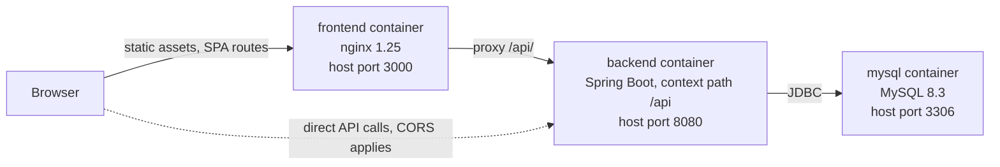

<h1 align="center">Job Tracker</h1>

<p align="center">
  A full-stack job application tracking system: a React frontend and a Spring Boot REST API,<br>
  with JWT authentication and a detailed analytics dashboard for your job search.
</p>

<p align="center">
  <a href="https://github.com/Jnolcox/job-tracker/actions/workflows/ci.yml"></a>
  
  <a href="https://github.com/Jnolcox/job-tracker/releases/latest"></a>
  <a href="LICENSE"></a>
</p>

<p align="center">
  
  
  
  
  <a href="https://github.com/Jnolcox/job-tracker/commits/develop"></a>
</p>


**Figure 1.** *The headline metric cards at the top of the dashboard.*


**Figure 2.** *Analytics views below the metric cards, including the stage funnel and distribution charts.*


**Figure 3.** *The application table, which is the primary editing surface.*

> **Audience:** anyone evaluating, running, or contributing to Job Tracker  ·  **Scope:** what the project is, how to run it, and where the rest of the documentation lives

Job Tracker records job applications, tracks each one through an 18-status pipeline, keeps an audit trail of every change, and computes analytics over the result. This page is the entry point: it covers the product, the stack, a working quick start, and a map of the full documentation set. Depth lives in [`docs/`](docs/README.md).

## Contents

- [1. Overview](#1-overview)
- [2. Features](#2-features)
- [3. Technology stack](#3-technology-stack)
- [4. Architecture](#4-architecture)
- [5. Quick start](#5-quick-start)
- [6. Configuration essentials](#6-configuration-essentials)
- [7. Documentation](#7-documentation)
- [8. Development basics](#8-development-basics)
- [9. Project status](#9-project-status)
- [10. License and credits](#10-license-and-credits)

---

## 1. Overview

Job Tracker is a single-user-per-account web application for managing a job search. You create an account, add applications as you send them, move each one through the pipeline as it progresses, and read the analytics the backend derives from that history.

It is built for one person tracking their own search. Every read and write is scoped to the authenticated user, and there is no sharing, no team view, and no multi-tenant administration. There is no hosted instance: you run it yourself, with Docker Compose or a local JDK and Node toolchain.

The pipeline has 18 statuses, from `APPLIED` through recruiter and technical screens, take-home and system-design rounds, `REFERENCE_CHECK`, offer handling, and the terminal outcomes `REJECTED`, `WITHDRAWN` and `GHOSTED` (`src/main/java/com/nolcox/jobtracking/domain/entity/ApplicationStatus.java:4-21`). Statuses are the backbone of nearly every analytic the system computes.

---

## 2. Features

**Tracking.** Full create, read, update and delete over applications, each carrying company, position, location, salary range, level, and a remote/hybrid/onsite (RTO) type. Every status change writes an `ApplicationEvent`, and those events render as a per-application journey timeline.

**Analytics.** The dashboard is assembled from independently toggleable views: metric cards, a stage funnel, salary distribution, time-in-stage, an activity heatmap, day-of-week and hour-of-day patterns, a status transition matrix, and company, location, and position insights. Funnel analytics and application health are off by default and enabled in dashboard settings.

**Authentication.** Registration and login issue a JWT; all application and analytics routes require it. Sessions are stateless.

**Interface.** Dashboard component visibility persists in `localStorage`. Pressing <kbd>?</kbd> on the dashboard opens the keyboard shortcut reference.

**API documentation.** SpringDoc serves Swagger UI and an OpenAPI document from the running backend.

Every chart is hand-written SVG and CSS. The frontend ships no charting library.

For the user-facing walkthrough, start at [docs/user-guide/01-getting-started.md](docs/user-guide/01-getting-started.md).

---

## 3. Technology stack

**Table 1.** *The technology used in each part of the system, with the version the build pins.*

| Area | Choice | Notes |
| --- | --- | --- |
| Backend language | Java 17 | `pom.xml:17-21` |
| Backend framework | Spring Boot 3.4.5 | web, data-jpa, security, validation, actuator |
| Build | Maven | JaCoCo enforces the coverage gate during `verify` |
| Security | Spring Security with jjwt 0.12.5 | HMAC-signed JWT, stateless sessions |
| Persistence | Spring Data JPA and Hibernate, MySQL 8 | `ddl-auto: update` on both runnable profiles |
| API documentation | SpringDoc OpenAPI 2.8.6 | Swagger UI at `/api/swagger-ui.html` |
| Mapping | ModelMapper 3.2.0 | used alongside hand-written mapping |
| Frontend | React 18 on Create React App (react-scripts 5) | `frontend/package.json:17-21` |
| Routing and HTTP | React Router 6, Axios 1.6 | Axios interceptors attach the token |
| Charts | none | hand-written SVG and CSS |
| Backend tests | JUnit 5, Mockito, Spring Security Test, JaCoCo | 85% line coverage minimum (`pom.xml:187`) |
| Frontend tests | Jest, React Testing Library, jest-axe | accessibility assertions included |
| Containers | MySQL 8.3, `eclipse-temurin:17-jre`, `nginx:1.25-alpine` | built by `docker-compose.yml` |

H2 appears in the build at test scope only. No runnable profile uses it, and no runnable profile enables the H2 console.

---

## 4. Architecture

Three processes: a MySQL database, a Spring Boot backend serving everything under the `/api` context path, and an nginx container serving the compiled React bundle. In the Compose stack, nginx also reverse-proxies `/api/` to the backend (`frontend/nginx.conf:45-46`), so the browser can talk to the API on the same origin as the UI. The backend port is published as well, and requests sent directly to it are subject to CORS.



**Figure 4.** *Request paths through the Compose stack. Solid arrows are the same-origin path the UI uses; the dotted arrow is the published backend port.*

Inside the backend, packages are layered as `domain` (entities, enums, Spring Data repositories), `application` (controllers, DTO records, use-case services), `infrastructure.security` (JWT issue, parse, and the per-request filter), `config` and `shared.exception`. Note that the `application` package holds both the web adapters and the use-case services, so the naming is layered rather than strictly hexagonal.

See [docs/development/01-architecture.md](docs/development/01-architecture.md) for the full picture and [docs/development/02-domain-and-persistence.md](docs/development/02-domain-and-persistence.md) for the entity model.

---

## 5. Quick start

### Option 1: Docker Compose

Brings up MySQL, the backend, and the frontend together. Requires only Docker with Compose v2.

```bash
git clone https://github.com/Jnolcox/job-tracker.git
cd job-tracker

cp .env.example .env      # then edit .env, see the security note below
docker compose up --build
```

**Table 2.** *Where each service is reachable from the host once the containers report healthy.*

| Service | URL |
| --- | --- |
| Frontend | http://localhost:3000 |
| Backend API | http://localhost:8080/api |
| Swagger UI | http://localhost:8080/api/swagger-ui.html |
| OpenAPI document | http://localhost:8080/api/api-docs |
| Health check | http://localhost:8080/api/actuator/health |

Tear down with `docker compose down`, or `docker compose down -v` to also drop the database volume.

> [!WARNING]
> `.env.example` ships a placeholder `JWT_SECRET` so the stack starts out of the box. Replace it before running anywhere other than your own machine:
>
> ```bash
> openssl rand -base64 48
> ```
>
> The backend Base64-decodes the secret before deriving the signing key (`src/main/java/com/nolcox/jobtracking/infrastructure/security/JwtService.java:89-91`), and the decoded length selects the HMAC variant, so 48 bytes keeps it on HS384. Change the MySQL passwords in the same pass. See [SECURITY.md](SECURITY.md) and [docs/development/04-security-and-authentication.md](docs/development/04-security-and-authentication.md).

### Option 2: Local development

Prerequisites: Java 17 or later, Maven 3.6 or later, Node.js 18 or later (the Docker build uses Node 22), and a running MySQL 8.

The backend expects a database matching the defaults committed in `src/main/resources/application.yml:16-19`:

```sql
CREATE DATABASE job_tracking_db;
CREATE USER 'jobtracker'@'localhost' IDENTIFIED BY 'jobtracker123';
GRANT ALL PRIVILEGES ON job_tracking_db.* TO 'jobtracker'@'localhost';
```

Hibernate creates and updates the schema at startup (`ddl-auto: update`). The checked-in script `src/main/resources/database/job_tracking_db_1.sql` is behind the entity model and is missing the `level` column, so Hibernate closes the gap either way.

Start the backend:

```bash
mvn spring-boot:run
```

Start the frontend in a second terminal:

```bash
cd frontend
npm install
npm start
```

The Create React App dev server runs on http://localhost:3000 and proxies API calls to port 8080.

### Demo credentials

On startup outside the `test` profile, `DataInitializer` seeds a user with five sample applications and logs the credentials in plaintext (`src/main/java/com/nolcox/jobtracking/config/DataInitializer.java:25`):

- Email: `test@example.com`
- Password: `password123`

This runs under the Docker profile too, so a `docker compose up` creates the account. Remove or disable the seeding before any real deployment.

> [!IMPORTANT]
> On a freshly seeded install, `GET /api/v1/job-applications/analytics/stage-durations` returns HTTP 500. The seeded applications have a null `statusChangedAt`, and `AnalyticsServiceImpl.java:523` dereferences it without a guard. The dashboard swallows the failure, so nothing visibly breaks, but the endpoint is unusable until you add applications through the UI. Details are in [docs/development/11-known-gaps.md](docs/development/11-known-gaps.md).

---

## 6. Configuration essentials

Configuration is Spring YAML plus a small set of environment variables. Two runnable profiles exist: the default profile (`application.yml`) and `docker` (`application-docker.yml`).

**Table 3.** *The variables most operators need. The full table, including the ones that have no effect, is on the configuration page.*

| Variable | Purpose |
| --- | --- |
| `JWT_SECRET` | Base64 signing key for JWTs. Override it. |
| `SPRING_DATASOURCE_URL` | JDBC URL for MySQL |
| `SPRING_DATASOURCE_USERNAME`, `SPRING_DATASOURCE_PASSWORD` | Database credentials |
| `CORS_ALLOWED_ORIGINS` | Comma-separated allowed origins |
| `MYSQL_ROOT_PASSWORD`, `MYSQL_DATABASE`, `MYSQL_USER`, `MYSQL_PASSWORD` | Read by Compose only, for the `mysql` service and the backend JDBC URL |

`DEMO_DATA_ENABLED` is worth knowing about before you deploy anything. It seeds an account whose password is published in this repository, and it defaults to true under Compose because that stack exists for local evaluation. Set it to false for anything others can reach.

Full detail, profile by profile and property by property, is in [docs/development/08-configuration.md](docs/development/08-configuration.md).

---

## 7. Documentation

Start at the documentation index, [docs/README.md](docs/README.md).

### For users

| Page | Covers |
| --- | --- |
| [01-getting-started.md](docs/user-guide/01-getting-started.md) | Accounts, first login, adding a first application |
| [02-dashboard-and-navigation.md](docs/user-guide/02-dashboard-and-navigation.md) | The dashboard layout and how to move around it |
| [03-tracking-applications.md](docs/user-guide/03-tracking-applications.md) | The pipeline statuses, editing, and the journey timeline |
| [04-analytics-and-insights.md](docs/user-guide/04-analytics-and-insights.md) | What each chart means and how it is computed |
| [05-settings-and-shortcuts.md](docs/user-guide/05-settings-and-shortcuts.md) | Dashboard settings and keyboard shortcuts |
| [06-troubleshooting.md](docs/user-guide/06-troubleshooting.md) | Common problems and what to do about them |

### For developers

| Page | Covers |
| --- | --- |
| [01-architecture.md](docs/development/01-architecture.md) | Layering, packages, request lifecycle |
| [02-domain-and-persistence.md](docs/development/02-domain-and-persistence.md) | Entities, enums, repositories, schema files |
| [03-api-reference.md](docs/development/03-api-reference.md) | Every endpoint, request and response shape |
| [04-security-and-authentication.md](docs/development/04-security-and-authentication.md) | JWT issue and validation, filter chain, CORS |
| [05-analytics-internals.md](docs/development/05-analytics-internals.md) | How each metric is derived, and where views disagree |
| [06-frontend.md](docs/development/06-frontend.md) | App shell, routing, hooks, charts, state |
| [07-testing.md](docs/development/07-testing.md) | Suites, fixtures, coverage gate |
| [08-configuration.md](docs/development/08-configuration.md) | Profiles, properties, environment variables |
| [09-deployment-and-operations.md](docs/development/09-deployment-and-operations.md) | Compose, images, nginx, health checks |
| [10-contributing.md](docs/development/10-contributing.md) | Working in the codebase |
| [11-known-gaps.md](docs/development/11-known-gaps.md) | Defects, dead code, and drift, recorded honestly |

### Project files

[CONTRIBUTING.md](CONTRIBUTING.md) for the short contributor guide, [SECURITY.md](SECURITY.md) for the security policy and reporting, [CODE_OF_CONDUCT.md](CODE_OF_CONDUCT.md), and [CHANGELOG.md](CHANGELOG.md) for release history.

---

## 8. Development basics

Run the backend suite and the coverage gate together:

```bash
mvn verify
```

The JaCoCo report lands in `target/site/jacoco/index.html`. The gate is a bundle-level 85% line coverage minimum (`pom.xml:187`), with `DataInitializer`, `OpenApiConfig`, the repository package, and the application entry point excluded.

Run the frontend suite:

```bash
cd frontend
CI=true npm test -- --watchAll=false
```

CI is `.github/workflows/ci.yml` and runs on push and pull request against `develop`. It has two jobs and no deployment step. The backend job checks out, sets up Temurin 17, runs `mvn --batch-mode verify` against in-memory H2 under the `test` profile, and uploads the JaCoCo report as an artifact. The frontend job runs `npm ci`, then the test suite with `CI=true`, then `npm run build`. Both must pass before a change merges. No image is built or published by CI; deployment is a manual `docker compose up --build`.

More detail is in [docs/development/07-testing.md](docs/development/07-testing.md) and [docs/development/10-contributing.md](docs/development/10-contributing.md).

---

## 9. Project status

Version 1.3.1. Actively developed against the `develop` branch. Both CI jobs pass at this version: `mvn verify` clears the 85% gate, and the frontend suite reports 603 passed and 2 skipped across 28 suites.

Stable and exercised: registration and login, the JWT filter chain and user-scoped authorization, application CRUD, the audit trail, the configuration endpoints that populate the UI dropdowns, and 11 of the 12 analytics endpoints, which return 200 against a seeded account.

Known rough edges, stated plainly:

- `analytics/stage-durations` returns 500 on a freshly seeded install (see the callout in section 5).
- A failed login clears credentials and hard-reloads the page, so the user never sees the error message the backend returned (`frontend/src/services/api.js:25-31`).
- Funnel and conversion analytics read each application's current status only, never its event history. An application that passed three interview rounds and was then rejected contributes nothing to any interview rate, while the event-derived transition matrix shows all three hops. The two views can disagree, and both are behaving as written.
- Analytics do not refresh after a create, update or delete; the page needs a manual reload.
- Quick wins and quick losses both count `OFFER_DECLINED` and `OFFER_RESCINDED`, so applications in those statuses are counted twice.
- Every Compose service sets an explicit `container_name`, so a second instance cannot run alongside the first even under a different project name.

The full list, with citations and severity, is [docs/development/11-known-gaps.md](docs/development/11-known-gaps.md). Read it before deploying this anywhere that matters.

---

## 10. License and credits

Released under the MIT License, copyright 2025-2026 John Nolcox. See [LICENSE](LICENSE).

Built with Spring Boot, Spring Security, Spring Data JPA, Hibernate, jjwt, SpringDoc OpenAPI, ModelMapper, React, React Router, Axios, JUnit 5, Mockito, JaCoCo, Jest, React Testing Library, and jest-axe. Issues and pull requests are welcome; see [CONTRIBUTING.md](CONTRIBUTING.md) to get started.

*Documentation current as of Job Tracker 2.0.0 (August 2026). Source of truth is the code; report drift as an issue.*
