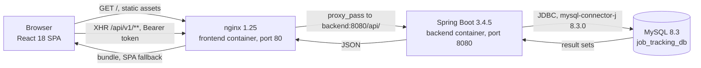
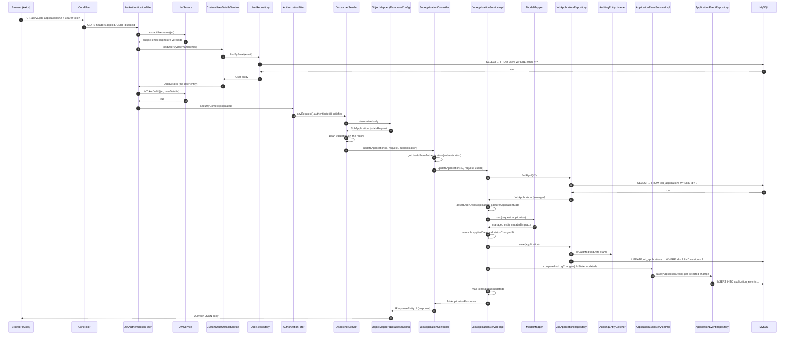

# Architecture

> **Audience:** Developers reading or changing the codebase for the first time  ·  **Scope:** Deployable pieces, package layout, request flow, cross-cutting concerns, and the design decisions behind them

This is the entry point for the developer documentation. It describes what Job Tracker is
made of, how the backend packages depend on each other, what happens to a single
authenticated write request from the browser to the database and back, and which design
choices were made deliberately along with what each one costs. Every other developer page
assumes the vocabulary established here.

## Contents

- [1. What the system is](#1-what-the-system-is)
- [2. Package structure and dependency direction](#2-package-structure-and-dependency-direction)
- [3. One authenticated write request, end to end](#3-one-authenticated-write-request-end-to-end)
- [4. Where cross-cutting concerns live](#4-where-cross-cutting-concerns-live)
- [5. Design decisions and what they cost](#5-design-decisions-and-what-they-cost)
- [6. See also](#6-see-also)

---

## 1. What the system is

Job Tracker is a single-user-per-account job application tracker. A user records the jobs
they have applied to, moves each application through a pipeline of statuses, and reads
analytics derived from that data. There are two deployable pieces plus a database.

**Table 1.** *The three runtime components, their images under Compose, and what each one owns.*

| Component | Built from | Listens on | Owns |
| --------- | ---------- | ---------- | ---- |
| Frontend | `frontend/Dockerfile`, a Node 22 build stage into `nginx:1.25-alpine` | container port 80, published as 3000 | Serving the compiled React bundle, SPA fallback routing, and reverse-proxying `/api/` to the backend (`frontend/nginx.conf`) |
| Backend | `Dockerfile` at the repository root | 8080 | HTTP API under the `/api` context path, authentication, business rules, analytics, persistence |
| Database | `mysql:8.3.0` | 3306 | The three tables `users`, `job_applications`, `application_events` |

The backend is a Spring Boot 3.4.5 application on Java 17, built with Maven under the
coordinates `com.nolcox:jobtracking:2.1.0` (`pom.xml:8-14`). The servlet context path is
`/api` and the port is 8080 (`src/main/resources/application.yml:1-4`), so a controller
mapped at `/v1/job-applications` is reachable at `/api/v1/job-applications`.

The frontend never calls the backend host directly. Its Axios instance uses the relative
base URL `/api/v1` (`frontend/src/services/api.js:5`), and nginx forwards `/api/` to
`http://backend:8080/api/` (`frontend/nginx.conf:45-46`). In local development the
Create React App dev server serves the same bundle and the backend's CORS configuration
allows `http://localhost:3000` by default (`src/main/java/com/nolcox/jobtracking/config/SecurityConfig.java:44-45`).



**Figure 1.** *System context. The browser talks only to nginx; nginx serves static files and proxies the API; the backend is the only component that reaches MySQL.*

> [!NOTE]
> H2 appears in `pom.xml` at runtime scope, but it is used only by the test profile
> (`src/test/resources/application-test.yml:2-6`). No runnable profile enables the H2
> console. MySQL is the database for every profile you can actually start.

---

## 2. Package structure and dependency direction

All backend code lives under `src/main/java/com/nolcox/jobtracking`. The layout is
loosely layered with hexagonal naming, and it holds together, with one caveat noted
below.

**Table 2.** *The packages under `com.nolcox.jobtracking` and what each one contains.*

| Package | Contents |
| ------- | -------- |
| (root) | `JobTrackingApplication`, the Spring Boot entry point |
| `application.controller` | `AuthController`, `ConfigController`, `JobApplicationController`, `GlobalExceptionHandler` |
| `application.dto.request` | Four request records: `AuthRequest`, `RegisterRequest`, `JobApplicationCreateRequest`, `JobApplicationUpdateRequest` |
| `application.dto.response` | Nineteen response types, several with nested records, including `ApiErrorResponse`, `ValidationErrorResponse`, `JobApplicationResponse`, `AuthResponse`, `ApplicationEventResponse`, and the analytics and config payloads |
| `application.service` | The five use-case interfaces: `AuthService`, `ConfigService`, `JobApplicationService`, `ApplicationEventService`, `AnalyticsService` |
| `application.service.impl` | The five matching `*Impl` classes: transactions, authorization checks, mapping, analytics arithmetic |
| `common.constants` | `ApiConstants` only |
| `config` | `DatabaseConfig`, `DataInitializer`, `ModelMapperConfig`, `OpenApiConfig`, `SecurityConfig` |
| `domain.entity` | `User`, `JobApplication`, `ApplicationEvent` and the enums `ApplicationStatus`, `RtoType`, `Level`, `Role`, `EventType` |
| `domain.repository` | `UserRepository`, `JobApplicationRepository`, `ApplicationEventRepository` |
| `infrastructure.security` | `JwtService`, `JwtAuthenticationFilter`, `JwtAuthenticationEntryPoint`, `CustomUserDetailsService` |
| `shared.exception` | `BusinessException`, `AuthenticationFailureException`, `ResourceNotFoundException`, `UnauthorizedException`, `ErrorMessages` |

### Dependency direction

Dependencies point inward toward `domain`:

- `application.controller` depends on `application.service` (interfaces only), on
  `application.dto`, and on `domain.entity` for enum path and query parameters. It also
  casts the authenticated principal to the `User` entity
  (`application/controller/JobApplicationController.java:516-519`).
- `application.service.impl` depends on `domain.repository`, `domain.entity`,
  `application.dto` and `shared.exception`.
- `domain.repository` depends on `domain.entity`.
- `domain.entity` depends on nothing else in the project. It does depend on Spring
  Security, because `User implements UserDetails`
  (`domain/entity/User.java:25`).
- `infrastructure.security` depends on `domain.repository` and `domain.entity`.
- `config` wires everything and depends on `infrastructure.security`.

Nothing in `domain` imports from `application`, and no controller imports a repository.

The caveat is naming: the `application` package holds both the web adapter
(`application.controller`) and the use cases (`application.service`). The package name
therefore does not tell you which side of the HTTP boundary a class sits on.
`GlobalExceptionHandler` is a related surprise: it lives in `application.controller`,
not in `shared.exception` where the exception types it translates are defined.

---

## 3. One authenticated write request, end to end

The reference write path is `PUT /api/v1/job-applications/{id}`, updating an existing
application. Figure 2 names every class the request touches, in order.



**Figure 2.** *A single authenticated update request. Transaction boundaries open at `JobApplicationServiceImpl.updateApplication` and commit after the response record is built.*

The corresponding source locations, step by step:

1. Spring Boot strips the `/api` context path, leaving the servlet path
   `/v1/job-applications/{id}`.
2. CORS is applied from `SecurityConfig.corsConfigurationSource()`
   (`config/SecurityConfig.java:84-97`); CSRF is disabled (`config/SecurityConfig.java:61`).
3. `JwtAuthenticationFilter` runs before `UsernamePasswordAuthenticationFilter`
   (`config/SecurityConfig.java:79`). It requires a `Bearer ` prefix, otherwise it passes
   the request through unauthenticated
   (`infrastructure/security/JwtAuthenticationFilter.java:46-49`). It then calls
   `JwtService.extractUsername` (`infrastructure/security/JwtService.java:29`),
   `CustomUserDetailsService.loadUserByUsername`
   (`infrastructure/security/CustomUserDetailsService.java:20-25`) and
   `JwtService.isTokenValid` (`infrastructure/security/JwtService.java:63`), and stores a
   `UsernamePasswordAuthenticationToken` in the `SecurityContextHolder`
   (`infrastructure/security/JwtAuthenticationFilter.java:67-79`). Any exception in that
   block is logged and swallowed, and the chain continues unauthenticated
   (`infrastructure/security/JwtAuthenticationFilter.java:86-88`).
4. Authorization evaluates the rules at `config/SecurityConfig.java:63-72`. This route
   falls under `anyRequest().authenticated()`. Sessions are `STATELESS`
   (`config/SecurityConfig.java:73-75`). If no authentication is present,
   `JwtAuthenticationEntryPoint` writes its own 401 body and the request ends
   (`config/SecurityConfig.java:76-78`,
   `infrastructure/security/JwtAuthenticationEntryPoint.java:32-42`).
5. `DispatcherServlet` resolves
   `JobApplicationController.updateApplication`
   (`application/controller/JobApplicationController.java:114-124`).
6. The body is deserialized by the `@Primary` `ObjectMapper` from `DatabaseConfig`
   (`config/DatabaseConfig.java:14-37`) and validated against the record's Bean
   Validation constraints (`application/dto/request/JobApplicationUpdateRequest.java:14-62`).
   A violation throws `MethodArgumentNotValidException` and jumps to step 11.
7. `getUserIdFromAuthentication` casts the principal to the `User` entity and reads its
   id (`application/controller/JobApplicationController.java:516-519`).
8. `JobApplicationServiceImpl.updateApplication` opens a read-write transaction that
   overrides the class-level `readOnly = true`
   (`application/service/impl/JobApplicationServiceImpl.java:174-175`). Inside it:
   `findById` or `ResourceNotFoundException`; `assertUserOwnsApplication` or
   `UnauthorizedException` (`:348-352`); a manual `captureApplicationState` snapshot
   (`:226`); `ModelMapper` copies non-null request fields onto the managed entity
   (`:180`); `appliedDate` and `statusChangedAt` are reconciled (`:182-198`); `save`
   (`:200`).
9. On flush, `AuditingEntityListener` stamps `@LastModifiedDate updatedAt` and Hibernate
   increments `@Version version` (`domain/entity/JobApplication.java:95-103`).
10. `ApplicationEventServiceImpl.compareAndLogChanges` joins the same transaction and
    inserts one `ApplicationEvent` per detected difference
    (`application/service/impl/JobApplicationServiceImpl.java:216-219`). The call is
    guarded by a null check because the event service is optional (see section 5).
11. Any exception thrown from steps 6 through 10 is translated by
    `GlobalExceptionHandler` (`application/controller/GlobalExceptionHandler.java:24`,
    `:36`, `:54`, `:76`, `:98`, `:110`).

The create path is identical through step 7, then diverges into
`createApplication` (`application/service/impl/JobApplicationServiceImpl.java:118-140`),
which logs an `APPLICATION_CREATED` event and returns 201 with a `Location` header
(`application/controller/JobApplicationController.java:94-112`).

---

## 4. Where cross-cutting concerns live

**Security filter chain.** `config/SecurityConfig.java`. One `SecurityFilterChain` bean
(`:58-82`) disables CSRF, installs CORS, declares the public matchers, sets `STATELESS`
sessions, registers `JwtAuthenticationEntryPoint`, and inserts `JwtAuthenticationFilter`
before `UsernamePasswordAuthenticationFilter`. The `PasswordEncoder` bean is BCrypt at
strength 12 (`:39`, `:47-50`). `@EnableMethodSecurity` is present (`:31`), but no
`@PreAuthorize` or `@Secured` annotation exists anywhere in `src/main`, so method
security is enabled and unused.

**Exception handling.** `application/controller/GlobalExceptionHandler.java`, a
`@RestControllerAdvice` (`:21`) with six handlers. Unauthenticated requests never reach
it: they are answered directly by `JwtAuthenticationEntryPoint`
(`infrastructure/security/JwtAuthenticationEntryPoint.java:26-42`). Message strings are
centralized in `shared/exception/ErrorMessages.java`, though three call sites bypass it
with string literals (`application/service/impl/JobApplicationServiceImpl.java:123`,
`:350`, `application/service/impl/ApplicationEventServiceImpl.java:371`). Status codes
and body shapes are documented on [the API reference page](./03-api-reference.md).

**Object mapping.** `config/ModelMapperConfig.java` defines the single `ModelMapper`
bean with `STRICT` matching, field matching at `PRIVATE` access level, and
`setSkipNullEnabled(true)` (`:10-18`). Private field access is what lets Java `record`
sources map at all, since records expose `companyName()` rather than
`getCompanyName()`. There are only two ModelMapper call sites, both in
`JobApplicationServiceImpl` (`:112` on create, `:180` on update). Every other conversion
in the codebase is a hand-written constructor call.

**JSON.** `config/DatabaseConfig.java` defines a `@Primary ObjectMapper` (`:14-37`). It
is used by the HTTP message converter and injected into
`JwtAuthenticationEntryPoint` (`infrastructure/security/JwtAuthenticationEntryPoint.java:23`).

**Constants.** `common/constants/ApiConstants.java` holds `API_VERSION_1` and
`CURRENT_API_VERSION` (`:10-11`).

> [!NOTE]
> Status: not wired. Neither `ApiConstants.API_VERSION_1` nor
> `ApiConstants.CURRENT_API_VERSION` has a reference anywhere in `src/main` or
> `src/test`. All three controllers hardcode the version segment
> (`application/controller/AuthController.java:19`,
> `application/controller/ConfigController.java:25`,
> `application/controller/JobApplicationController.java:54`), and so do the security
> matchers (`config/SecurityConfig.java:64-66`).

**Auditing.** Enabled once, by `@EnableJpaAuditing` on the entry point
(`JobTrackingApplication.java:8-11`). See
[Domain and persistence](./02-domain-and-persistence.md) for which entities use it.

---

## 5. Design decisions and what they cost

### No bidirectional entity relationships

Both `@OneToMany` collections were removed and the removals are documented in the
entities themselves.

`domain/entity/User.java:59-63`:

```java
// NOTE: The bidirectional @OneToMany relationship to JobApplication was removed
// because it causes issues with Hibernate's persistence context management during
// application deletion. Job applications are accessed through JobApplicationRepository
// instead of navigating from User. This is a cleaner design that follows the
// "favor aggregates over entity relationships" principle.
```

`domain/entity/JobApplication.java:105-109`:

```java
// NOTE: The bidirectional @OneToMany relationship to ApplicationEvent was removed
// to avoid Hibernate persistence context issues during application deletion within
// transactional tests. Events are cascade-deleted at the database level via
// ON DELETE CASCADE in the schema. Events are accessed through
// ApplicationEventRepository instead of navigating from JobApplication.
```

What it buys: no lazy-collection initialization inside a `@Data`-generated `equals`, no
orphan-removal ordering problems, and a clear rule that every read of another aggregate
goes through a repository.

What it costs:

- Cascade behavior now lives in the schema rather than in the mapping, so it is only as
  correct as the SQL. The production init script does declare
  `ON DELETE CASCADE` on both foreign keys
  (`src/main/resources/database/job_tracking_db_1.sql:38`, `:53`), but the test schema
  declares it only on `application_events`, not on `job_applications`
  (`src/test/resources/schema.sql:37`, `:50`). Deleting a user behaves differently under
  test than in production.
- Deletion is also enforced in code, because the persistence context needs it.
  `deleteApplication` explicitly calls `eventRepository.deleteByApplicationId(id)` before
  deleting the application, with a comment explaining why
  (`application/service/impl/JobApplicationServiceImpl.java:275-280`).
- One justification elsewhere in the codebase is now stale. `captureApplicationState`
  copies 21 fields by hand instead of using ModelMapper, and its comments cite a
  "circular reference" risk from the bidirectional `User` relationship that no longer
  exists (`application/service/impl/JobApplicationServiceImpl.java:230-232`, `:227-228`).

### A hand-built `@Primary` ObjectMapper

`config/DatabaseConfig.java:14-37` constructs an `ObjectMapper` directly, registers
`JavaTimeModule`, and adds a `SimpleModule` that serializes `BigDecimal` at two decimal
places.

What it costs: defining a user `ObjectMapper` bean makes Spring Boot's
`JacksonAutoConfiguration` back off, so the `spring.jackson.*` properties in
`src/main/resources/application.yml:10-14` never reach the mapper the HTTP message
converter uses. `write-dates-as-timestamps: false` is inert. Every `Instant` in every
response therefore serializes as an epoch-second decimal, confirmed at runtime, for
example `"timestamp":1786590482.142765877`. The frontend compensates for exactly this
format in its data adapter (`frontend/src/utils/dataAdapter.js:22-24`, `:41-43`).

Two smaller costs: the class is named `DatabaseConfig` but contains no datasource or JPA
configuration, and the `BigDecimal` serializer applies to a type no entity or DTO in the
codebase uses (every money field is `Double`).

### Stateless JWT authentication

Sessions are `STATELESS` (`config/SecurityConfig.java:73-75`) and every request carries
its own bearer token.

What it costs: there is no server-side session to invalidate.
`AuthServiceImpl.logout` only clears the `SecurityContextHolder`, which is per-request,
so a leaked token stays valid until it expires. The signing algorithm is also implicit:
`JwtService.getSigningKey` passes decoded secret bytes to `Keys.hmacShaKeyFor`
(`infrastructure/security/JwtService.java:89-91`), which picks the HMAC variant by key
length. The committed default decodes to 48 bytes, which selects HS384. Changing the
secret's length silently changes the algorithm. Details are on
[Security and authentication](./04-security-and-authentication.md).

### Optional, setter-injected event service

`JobApplicationServiceImpl` takes its four core dependencies through
`@RequiredArgsConstructor`, but receives `ApplicationEventService` through
`@Autowired(required = false)` setter injection
(`application/service/impl/JobApplicationServiceImpl.java:73`, `:70-71`). The stated
reason is to let the service run in tests without event logging.

What it costs: every write path must null-check before logging
(`:121`, `:203`, `:320`), and the audit trail is a behavior that can be absent without
any signal at the type level.

### Analytics computed in Java, not SQL

`AnalyticsServiceImpl` reads `JobApplicationRepository.findAllByUserId(userId)` and
aggregates in memory. The event repository is consulted in only three places in the whole
service.

What it costs: a dashboard load that hits ten analytics endpoints runs that same
full-per-user query roughly ten times, and funnel and conversion figures are derived from
current status only rather than from event history. See
[Analytics internals](./05-analytics-internals.md) for the consequences.

### Schema managed by Hibernate

`spring.jpa.hibernate.ddl-auto: update` is set in both runnable profiles
(`src/main/resources/application.yml:22-23`,
`src/main/resources/application-docker.yml:27-28`). There is no Flyway or Liquibase.

What it costs: schema evolution has no version history and no rollback, Hibernate never
drops or narrows a column, and the checked-in MySQL init script has already drifted from
the entities. See [Domain and persistence](./02-domain-and-persistence.md), section 7.

---

## 6. See also

- [Domain and persistence](./02-domain-and-persistence.md) for the entities, enums,
  repositories and schema files named above.
- [API reference](./03-api-reference.md) for the routes, request and response shapes, and
  error bodies.
- [Security and authentication](./04-security-and-authentication.md) for the filter
  chain, token format, and the defects in the login path.
- [Analytics internals](./05-analytics-internals.md) for the status sets and formulas
  behind the dashboard.
- [Known gaps](./11-known-gaps.md) for the full list of defects, dead code and drift.

*Documentation current as of Job Tracker 2.1.0 (August 2026). Source of truth is the code; report drift as an issue.*
