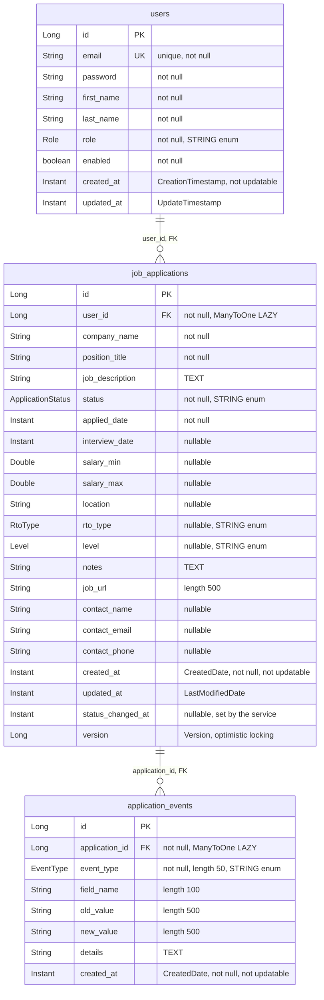

# Domain and persistence

> **Audience:** Developers changing entities, queries, or the database schema  ·  **Scope:** JPA entities, relationships, auditing, optimistic locking, enums, repositories, DTO mapping, and schema management

This page describes the persistence layer of the backend: the three JPA entities and
every field on them, how the entities relate to each other, how timestamps and version
numbers are maintained, the five enums, the three Spring Data repositories with their
queries, how request records become entities, and how the schema is actually created in
each environment. Read [Architecture](./01-architecture.md) first for the package layout
and request flow that surround this material.

## Contents

- [1. Entity model at a glance](#1-entity-model-at-a-glance)
- [2. The entities](#2-the-entities)
- [3. Relationships, fetch and cascade](#3-relationships-fetch-and-cascade)
- [4. Auditing and optimistic locking](#4-auditing-and-optimistic-locking)
- [5. Enums](#5-enums)
- [6. Repositories](#6-repositories)
- [7. DTO to entity mapping](#7-dto-to-entity-mapping)
- [8. Schema management](#8-schema-management)
- [9. See also](#9-see-also)

---

## 1. Entity model at a glance

Three tables, two foreign keys, no join tables and no collections mapped on the Java
side.



**Figure 1.** *The three entities and their two foreign keys. The `||--o{` relationships exist only as `@ManyToOne` on the child side; neither parent maps a collection.*

---

## 2. The entities

### User

`src/main/java/com/nolcox/jobtracking/domain/entity/User.java`. Mapped to `users`
(`:19-20`), annotated `@Data @Builder @NoArgsConstructor @AllArgsConstructor`
(`:21-24`), and it implements
`org.springframework.security.core.userdetails.UserDetails` (`:25`). It carries no
`@EntityListeners`.

**Table 1.** *Fields of `User`, their column mapping and constraints.*

| Field | Java type | Column | Nullability and constraints | Source |
| ----- | --------- | ------ | --------------------------- | ------ |
| `id` | `Long` | `id` | `@Id @GeneratedValue(strategy = IDENTITY)` | `User.java:27-29` |
| `email` | `String` | `email` | `@Column(unique = true, nullable = false)`, `@Email` | `User.java:31-33` |
| `password` | `String` | `password` | `@Column(nullable = false)`, stores a BCrypt hash | `User.java:35-36` |
| `firstName` | `String` | `first_name` | `nullable = false` | `User.java:38-39` |
| `lastName` | `String` | `last_name` | `nullable = false` | `User.java:41-42` |
| `role` | `Role` | `role` | `nullable = false`, `@Enumerated(EnumType.STRING)` | `User.java:44-46` |
| `enabled` | `boolean` | `enabled` | `nullable = false`, field initializer `= true` | `User.java:48-49` |
| `createdAt` | `Instant` | `created_at` | `@CreationTimestamp`, `updatable = false` | `User.java:51-53` |
| `updatedAt` | `Instant` | `updated_at` | `@UpdateTimestamp` | `User.java:55-57` |

`getAuthorities()` returns a single `SimpleGrantedAuthority` of `"ROLE_" + role.name()`
(`:65-68`), and `getUsername()` returns the email (`:70-73`). The other `UserDetails`
methods are not overridden, so they use the Spring Security 6 interface defaults, which
all return `true`. `isEnabled()` resolves to the Lombok getter on the `enabled` field.

> [!WARNING]
> `@Builder` ignores the `= true` field initializer on `enabled`. A `User.builder()` call
> that omits `.enabled(...)` produces `enabled == false` and that user cannot log in.
> Both production call sites set it explicitly
> (`application/service/impl/AuthServiceImpl.java:57`,
> `config/DataInitializer.java:47`).

### JobApplication

`domain/entity/JobApplication.java`. Mapped to `job_applications` with
`@EntityListeners(AuditingEntityListener.class)` (`:17-19`) and
`@Data @NoArgsConstructor @AllArgsConstructor @Builder` (`:20-23`).

**Table 2.** *Fields of `JobApplication`, their column mapping and constraints.*

| Field | Java type | Column | Nullability and constraints | Source |
| ----- | --------- | ------ | --------------------------- | ------ |
| `id` | `Long` | `id` | `@Id @GeneratedValue(strategy = IDENTITY)` | `JobApplication.java:26-28` |
| `user` | `User` | `user_id` | `@ManyToOne(fetch = LAZY)`, `@JoinColumn(nullable = false)` | `JobApplication.java:30-32` |
| `companyName` | `String` | `company_name` | `nullable = false`, `@NotBlank`, `@Size(max = 255)` | `JobApplication.java:34-37` |
| `positionTitle` | `String` | `position_title` | `nullable = false`, `@NotBlank`, `@Size(max = 255)` | `JobApplication.java:39-42` |
| `jobDescription` | `String` | `job_description` | `columnDefinition = "TEXT"`, nullable | `JobApplication.java:44-45` |
| `status` | `ApplicationStatus` | `status` | `nullable = false`, `@Enumerated(STRING)`, no `@NotNull` on the entity | `JobApplication.java:47-49` |
| `appliedDate` | `Instant` | `applied_date` | `nullable = false` | `JobApplication.java:51-52` |
| `interviewDate` | `Instant` | `interview_date` | nullable | `JobApplication.java:54-55` |
| `salaryMin` | `Double` | `salary_min` | nullable | `JobApplication.java:57-58` |
| `salaryMax` | `Double` | `salary_max` | nullable | `JobApplication.java:60-61` |
| `location` | `String` | `location` | nullable, `@Size(max = 255)` | `JobApplication.java:63-65` |
| `rtoType` | `RtoType` | `rto_type` | nullable, `@Enumerated(STRING)` | `JobApplication.java:67-69` |
| `level` | `Level` | `level` | nullable, `@Enumerated(STRING)` | `JobApplication.java:71-73` |
| `notes` | `String` | `notes` | `columnDefinition = "TEXT"`, nullable | `JobApplication.java:75-76` |
| `jobUrl` | `String` | `job_url` | `length = 500`, nullable | `JobApplication.java:78-79` |
| `contactName` | `String` | `contact_name` | nullable | `JobApplication.java:81-82` |
| `contactEmail` | `String` | `contact_email` | nullable, `@Email` | `JobApplication.java:84-86` |
| `contactPhone` | `String` | `contact_phone` | nullable | `JobApplication.java:88-89` |
| `createdAt` | `Instant` | `created_at` | `@CreatedDate`, `nullable = false`, `updatable = false` | `JobApplication.java:91-93` |
| `updatedAt` | `Instant` | `updated_at` | `@LastModifiedDate` | `JobApplication.java:95-97` |
| `statusChangedAt` | `Instant` | `status_changed_at` | nullable, set by the service, never by auditing | `JobApplication.java:99-100` |
| `version` | `Long` | `version` | `@Version` | `JobApplication.java:102-103` |

> [!NOTE]
> `statusChangedAt` is nullable and no lifecycle callback populates it. The write paths
> default it to `Instant.now()`, but anything that builds the entity directly, such as the
> demo seeder, has to set it. Analytics that measure time in a stage skip an application
> that has no value rather than failing.


`@Data` generates `equals` and `hashCode` over all fields, including the lazy `user`
reference and `version`. That means calling `equals` can trigger proxy initialization,
and an entity's hash changes after a flush increments `version`.

### ApplicationEvent

`domain/entity/ApplicationEvent.java`. Mapped to `application_events` with a declared
index on `(application_id, created_at)` (`:37-40`),
`@EntityListeners(AuditingEntityListener.class)` (`:41`) and
`@Data @NoArgsConstructor @AllArgsConstructor @Builder` (`:42-45`).

**Table 3.** *Fields of `ApplicationEvent`, their column mapping and constraints.*

| Field | Java type | Column | Nullability and constraints | Source |
| ----- | --------- | ------ | --------------------------- | ------ |
| `id` | `Long` | `id` | `@Id @GeneratedValue(strategy = IDENTITY)` | `ApplicationEvent.java:51-53` |
| `application` | `JobApplication` | `application_id` | `@ManyToOne(fetch = LAZY)`, `@JoinColumn(nullable = false)`, `@NotNull` | `ApplicationEvent.java:59-62` |
| `eventType` | `EventType` | `event_type` | `nullable = false`, `length = 50`, `@Enumerated(STRING)`, `@NotNull` | `ApplicationEvent.java:68-71` |
| `fieldName` | `String` | `field_name` | `length = 100`, nullable, `@Size(max = 100)` | `ApplicationEvent.java:78-80` |
| `oldValue` | `String` | `old_value` | `length = 500`, nullable, `@Size(max = 500)` | `ApplicationEvent.java:87-89` |
| `newValue` | `String` | `new_value` | `length = 500`, nullable, `@Size(max = 500)` | `ApplicationEvent.java:95-97` |
| `details` | `String` | `details` | `columnDefinition = "TEXT"`, nullable | `ApplicationEvent.java:103-104` |
| `createdAt` | `Instant` | `created_at` | `@CreatedDate`, `nullable = false`, `updatable = false` | `ApplicationEvent.java:110-112` |

There is no `@LastModifiedDate` on this entity. Events are append-only by convention, not
by constraint: nothing in the mapping prevents an update.

---

## 3. Relationships, fetch and cascade

**Table 4.** *The two mapped associations.*

| Association | Owning side | Fetch | Cascade | Orphan removal | Inverse side |
| ----------- | ----------- | ----- | ------- | -------------- | ------------ |
| `JobApplication.user` | `JobApplication` | `LAZY` | none | no | none mapped |
| `ApplicationEvent.application` | `ApplicationEvent` | `LAZY` | none | no | none mapped |

Neither parent entity maps a collection. Both removals are deliberate and documented in
the entities themselves (`domain/entity/User.java:59-63`,
`domain/entity/JobApplication.java:105-109`). The stated reasons are Hibernate
persistence-context problems during deletion, and the stated replacement is repository
access rather than navigation.

Three consequences follow.

1. **Cascade delete is a schema concern.** `JobApplication`'s comment says events are
   removed by `ON DELETE CASCADE`. That is true of the production init script
   (`src/main/resources/database/job_tracking_db_1.sql:53`) and of the test schema
   (`src/test/resources/schema.sql:50`). For the `users` to `job_applications` foreign
   key the two files disagree: production cascades
   (`src/main/resources/database/job_tracking_db_1.sql:38`), the test schema does not
   (`src/test/resources/schema.sql:37`).
2. **Deletion is also enforced in code.** `deleteApplication` calls
   `eventRepository.deleteByApplicationId(id)` before deleting the application, with a
   comment explaining that the persistence context needs it even though the database
   cascades (`application/service/impl/JobApplicationServiceImpl.java:275-282`).
   The two bulk deletes follow the same events-first rule
   (`JobApplicationServiceImpl.java:368-383`, `:387-402`), but for a stronger reason:
   they issue native `DELETE` statements that bypass JPA entirely, so the database
   cascade is the only thing that would otherwise clean up events, and the test schema
   does not have it.
3. **`spring.jpa.open-in-view` is `false`** in both runnable profiles
   (`src/main/resources/application.yml:29`,
   `src/main/resources/application-docker.yml:34`), so a lazy `user` or `application`
   reference cannot be initialized after the service transaction closes. Both
   `mapToResponse` methods stay inside the transaction and read only the id of the lazy
   side (`application/service/impl/ApplicationEventServiceImpl.java:375-386`).

---

## 4. Auditing and optimistic locking

### Auditing

JPA auditing is enabled exactly once, by `@EnableJpaAuditing` on the entry point
(`JobTrackingApplication.java:8-11`). There is no `AuditorAware` bean, so only the date
annotations are in play, not `@CreatedBy` or `@LastModifiedBy`.

Auditing is applied inconsistently across the three entities.

**Table 5.** *How each entity's timestamps are maintained.*

| Entity | Mechanism | Created | Modified |
| ------ | --------- | ------- | -------- |
| `User` | Hibernate annotations, no `@EntityListeners` | `@CreationTimestamp` (`User.java:51`) | `@UpdateTimestamp` (`User.java:55`) |
| `JobApplication` | Spring Data, `AuditingEntityListener` | `@CreatedDate` (`JobApplication.java:91`) | `@LastModifiedDate` (`JobApplication.java:95`) |
| `ApplicationEvent` | Spring Data, `AuditingEntityListener` | `@CreatedDate` (`ApplicationEvent.java:110`) | none |

The practical difference is that Hibernate's annotations are applied by Hibernate's own
event listeners while Spring Data's are applied by `AuditingHandler` through the entity
listener. Both work here, but a reader tracing where `created_at` comes from has to check
which entity they are looking at.

There are no `@PrePersist`, `@PreUpdate` or `@PostLoad` callbacks anywhere in the
codebase. Every timestamp is either annotation-driven or set by hand in a service.

> [!NOTE]
> `ApplicationEventServiceImpl` sets `.createdAt(Instant.now())` on all six event
> builders (`:68`, `:91`, `:113`, `:135`, `:158`, `:180`). Spring Data's auditing handler
> overwrites the value on persist, so those six assignments have no effect on what is
> stored.

### Optimistic locking

`JobApplication.version` is annotated `@Version` (`JobApplication.java:102-103`). It has
no `@Column`, so the column name is `version`. Hibernate includes it in the `WHERE`
clause of every `UPDATE` and increments it on success; a concurrent update that lost the
race raises `ObjectOptimisticLockingFailureException`.

`User` and `ApplicationEvent` have no `@Version`.

> [!WARNING]
> `GlobalExceptionHandler` has no handler for `ObjectOptimisticLockingFailureException`
> (`application/controller/GlobalExceptionHandler.java:24-120`), so a lost update surfaces
> to the client as a generic 500 with the body message `"An unexpected error occurred"`.
> `version` is also not included in `JobApplicationResponse`
> (`application/service/impl/JobApplicationServiceImpl.java:417-440`), so a client has no
> way to send it back for a conditional update.

---

## 5. Enums

All five enums live in `domain.entity`. Every one is persisted with
`@Enumerated(EnumType.STRING)`, so the database stores the constant name.

### ApplicationStatus

`domain/entity/ApplicationStatus.java`, 18 constants, no fields and no methods. The enum
itself carries no grouping. The stage each status belongs to is defined separately, in
the `STATUS_METADATA` map in
`application/service/impl/ConfigServiceImpl.java:57-110`, and served to the frontend by
`GET /api/v1/config/statuses`.

**Table 6.** *The 18 pipeline statuses in declaration order, with the display label and stage assigned by `ConfigServiceImpl`.*

| Status | Declared at | Label | Stage |
| ------ | ----------- | ----- | ----- |
| `APPLIED` | `ApplicationStatus.java:4` | Applied | `WAITING` |
| `RECRUITER_SCREEN` | `:5` | Recruiter Screen | `INTERVIEWING` |
| `TECH_SCREEN` | `:6` | Technical Screen | `TECHNICAL` |
| `TAKE_HOME` | `:7` | Take Home Assignment | `TECHNICAL` |
| `SYSTEM_DESIGN` | `:8` | System Design | `TECHNICAL` |
| `TECHNICAL_I` | `:9` | Technical Interview I | `TECHNICAL` |
| `TECHNICAL_II` | `:10` | Technical Interview II | `TECHNICAL` |
| `REFERENCE_CHECK` | `:11` | Reference Check | `INTERVIEWING` |
| `OFFER_RECEIVED` | `:12` | Offer Received | `OFFER` |
| `NEGOTIATING` | `:13` | Negotiating | `OFFER` |
| `OFFER_ACCEPTED` | `:14` | Offer Accepted | `OFFER` |
| `OFFER_DECLINED` | `:15` | Offer Declined | `REJECTED` |
| `OFFER_RESCINDED` | `:16` | Offer Rescinded | `REJECTED` |
| `REJECTED` | `:17` | Rejected | `REJECTED` |
| `WITHDRAWN` | `:18` | Withdrawn | `WITHDRAWN` |
| `ON_HOLD` | `:19` | On Hold | `WAITING` |
| `WAITING_FOR_RESPONSE` | `:20` | Waiting for Response | `WAITING` |
| `GHOSTED` | `:21` | Ghosted | `REJECTED` |

The reverse index `STATUS_GROUPS` (`ConfigServiceImpl.java:113-123`) lists the same six
stages with their member statuses, and it agrees with Table 6.

> [!IMPORTANT]
> These stages are not the only grouping of `ApplicationStatus` in the codebase.
> `AnalyticsServiceImpl` defines seven further `EnumSet` groupings for its own
> calculations (`AnalyticsServiceImpl.java:98-198`), and
> `ApplicationEventRepository.findTerminalStatusTransitionsByUserId` hardcodes a
> six-name `IN` list as string literals (`ApplicationEventRepository.java:210`). The
> groupings do not all agree: `REFERENCE_CHECK` is `INTERVIEWING` here but is a member of
> `TECH_STATUSES` in analytics (`AnalyticsServiceImpl.java:110-123`). There is no single
> source of truth for which statuses are terminal.

### RtoType

`domain/entity/RtoType.java`, 5 constants. Labels come from `RTO_LABELS`
(`ConfigServiceImpl.java:128-134`).

**Table 7.** *Return-to-office types and their labels.*

| Constant | Declared at | Label |
| -------- | ----------- | ----- |
| `REMOTE` | `RtoType.java:4` | Remote |
| `HYBRID_2` | `:5` | Hybrid (2 days/week) |
| `HYBRID_3` | `:6` | Hybrid (3 days/week) |
| `HYBRID_4` | `:7` | Hybrid (4 days/week) |
| `ONSITE` | `:8` | On-site |

### Level

`domain/entity/Level.java`, 9 constants. Labels come from `LEVEL_LABELS`
(`ConfigServiceImpl.java:139-149`).

**Table 8.** *Seniority levels and their labels.*

| Constant | Declared at | Label |
| -------- | ----------- | ----- |
| `JUNIOR` | `Level.java:4` | Junior |
| `MID` | `:5` | Mid-Level |
| `SENIOR` | `:6` | Senior |
| `STAFF` | `:7` | Staff |
| `PRINCIPAL` | `:8` | Principal |
| `LEAD` | `:9` | Lead |
| `MANAGER` | `:10` | Manager |
| `DIRECTOR` | `:11` | Director |
| `VP` | `:12` | VP |

### EventType

`domain/entity/EventType.java`, 6 constants, each with javadoc.

**Table 9.** *Audit event types and when the service writes each one.*

| Constant | Declared at | Written by |
| -------- | ----------- | ---------- |
| `APPLICATION_CREATED` | `EventType.java:27` | `logApplicationCreated` (`ApplicationEventServiceImpl.java:59-72`) |
| `STATUS_CHANGED` | `:33` | `logStatusChanged` (`ApplicationEventServiceImpl.java:80-95`) |
| `INTERVIEW_SCHEDULED` | `:39` | `logInterviewScheduled` (`ApplicationEventServiceImpl.java:103-117`) |
| `INTERVIEW_UPDATED` | `:45` | `logInterviewUpdated` (`ApplicationEventServiceImpl.java:125-139`) |
| `FIELD_UPDATED` | `:51` | `logFieldUpdated` (`ApplicationEventServiceImpl.java:147-162`) |
| `NOTE_ADDED` | `:57` | `logNoteAdded` (`ApplicationEventServiceImpl.java:170-184`) |

### Role

`domain/entity/Role.java`, 2 constants: `USER` (`:4`) and `ADMIN` (`:5`).

> [!NOTE]
> Status: not wired. `Role.ADMIN` is never assigned anywhere in `src/main`. Registration
> always uses `Role.USER` (`application/service/impl/AuthServiceImpl.java:56`,
> `config/DataInitializer.java:46`), and although `@EnableMethodSecurity` is on
> (`config/SecurityConfig.java:31`), no `@PreAuthorize` or `@Secured` annotation exists in
> the codebase. The admin role has no effect.

---

## 6. Repositories

All three interfaces are in `domain.repository` and extend `JpaRepository`, so they
inherit `save`, `findById`, `findAll`, `delete`, `count` and the rest of the Spring Data
CRUD surface. Only the declared methods are listed below.

### UserRepository

`domain/repository/UserRepository.java`. Extends `JpaRepository<User, Long>` (`:8`). It
is the only one of the three not annotated `@Repository`, which is harmless because
Spring Data proxies the interface regardless.

**Table 10.** *Declared methods on `UserRepository`.*

| Method | Kind | Notes | Source |
| ------ | ---- | ----- | ------ |
| `Optional<User> findByEmail(String email)` | derived | Used by `CustomUserDetailsService` and `AuthServiceImpl` | `UserRepository.java:9` |
| `Boolean existsByEmail(String email)` | derived | Returns the boxed `Boolean`, not `boolean` | `UserRepository.java:10` |

### JobApplicationRepository

`domain/repository/JobApplicationRepository.java`. Extends
`JpaRepository<JobApplication, Long>` and `JpaSpecificationExecutor<JobApplication>`
(`:16-17`).

**Table 11.** *Declared methods on `JobApplicationRepository`.*

| Method | Kind | Returns | Source |
| ------ | ---- | ------- | ------ |
| `findByUserId(Long, Pageable)` | derived | `Page<JobApplication>` | `:20` |
| `findByUserIdAndStatus(Long, ApplicationStatus, Pageable)` | derived | `Page<JobApplication>` | `:21` |
| `findByUserIdWithFilters(Long, ApplicationStatus, String, Pageable)` | `@Query` | `Page<JobApplication>` | `:23-30` |
| `countByUserIdAndStatus(Long, ApplicationStatus)` | `@Query` | `Long` | `:31-34` |
| `countByUserIdAndStatusIn(Long, Set<ApplicationStatus>)` | `@Query` | `long` | `:36-39` |
| `countByUserId(Long)` | `@Query` | `long` | `:41-42` |
| `countByStatusForUserRaw(Long)` | `@Query` | `List<Object[]>` | `:44-46` |
| `countByStatusForUser(Long)` | `default` | `Map<ApplicationStatus, Long>` | `:48-55` |
| `searchApplications(Long, String, ApplicationStatus, Pageable)` | `@Query` | `Page<JobApplication>` | `:57-65` |
| `findRecentApplicationsByUserId(Long, Pageable)` | `@Query` | `List<JobApplication>` | `:67-70` |
| `findRecentApplicationsByUserId(Long, int)` | `default` | `List<JobApplication>` | `:72-75` |
| `findAllByUserId(Long)` | derived | `List<JobApplication>` | `:86` |
| `deleteAllByUserId(Long)` | `@Modifying` native | `void` | `:106-109` |
| `findIdsByUserIdAndStatusIn(Long, Set<ApplicationStatus>)` | `@Query` | `List<Long>` | `:126-128` |
| `deleteAllByIdIn(List<Long>)` | `@Modifying` native | `void` | `:152-155` |

The JPQL, verbatim:

```sql
-- findByUserIdWithFilters (JobApplicationRepository.java:24-26)
SELECT ja FROM JobApplication ja WHERE ja.user.id = :userId
AND (:status IS NULL OR ja.status = :status)
AND (:companyName IS NULL OR LOWER(ja.companyName) LIKE LOWER(CONCAT('%', :companyName, '%')))

-- countByUserIdAndStatus (:31-32)
SELECT COUNT(ja) FROM JobApplication ja WHERE ja.user.id = :userId AND ja.status = :status

-- countByUserIdAndStatusIn (:36-37)
SELECT COUNT(ja) FROM JobApplication ja WHERE ja.user.id = :userId AND ja.status IN :statuses

-- countByUserId (:41)
SELECT COUNT(ja) FROM JobApplication ja WHERE ja.user.id = :userId

-- countByStatusForUserRaw (:44-45)
SELECT ja.status, COUNT(ja) FROM JobApplication ja WHERE ja.user.id = :userId GROUP BY ja.status

-- findIdsByUserIdAndStatusIn (:126)
SELECT ja.id FROM JobApplication ja WHERE ja.user.id = :userId AND ja.status IN :statuses

-- searchApplications (:57-61)
SELECT ja FROM JobApplication ja WHERE ja.user.id = :userId
AND (:searchTerm IS NULL OR
     LOWER(ja.companyName) LIKE LOWER(CONCAT('%', :searchTerm, '%')) OR
     LOWER(ja.positionTitle) LIKE LOWER(CONCAT('%', :searchTerm, '%')))
AND (:status IS NULL OR ja.status = :status)

-- findRecentApplicationsByUserId (:67-68)
SELECT ja FROM JobApplication ja WHERE ja.user.id = :userId ORDER BY ja.appliedDate DESC
```

The two bulk deletes are the only native SQL on this interface (`:108`, `:154`):

```sql
-- deleteAllByUserId (:108)
DELETE FROM job_applications WHERE user_id = :userId

-- deleteAllByIdIn (:154)
DELETE FROM job_applications WHERE id IN (:ids)
```

Both carry `@Modifying(clearAutomatically = true)` and `@Transactional`. `clearAutomatically` matters here: a bulk delete bypasses the persistence context, so without it entities already loaded in the session would survive as stale managed instances. Neither method is safe to call on its own; the corresponding events must be deleted first, and `JobApplicationServiceImpl` is the only caller that enforces that order. `deleteAllByIdIn` must not be called with an empty list, since `IN ()` is invalid SQL.

`countByStatusForUserRaw` returns rows whose element `[0]` is an `ApplicationStatus` and
`[1]` a `Long`. The `default` method `countByStatusForUser` streams them into
`Collectors.toMap` with no merge function (`:40-44`); this is safe only because the
`GROUP BY` guarantees distinct keys.

`findRecentApplicationsByUserId(Long, Pageable)` uses the `Pageable` purely to bound the
result size; it returns a plain `List`, not a `Page`.

`findAllByUserId` is the workhorse for analytics. Almost every method in
`AnalyticsServiceImpl` calls it and aggregates the full per-user result set in Java.

> [!NOTE]
> Status: not wired. `countByUserIdAndStatus` (`:31-34`) has no production caller.
> The single-status count is superseded by `countByStatusForUser`, which returns
> every status in one query, and by `countByUserIdAndStatusIn` for the non-active
> subset.

### ApplicationEventRepository

`domain/repository/ApplicationEventRepository.java`. Extends
`JpaRepository<ApplicationEvent, Long>` (`:29-30`).

**Table 12.** *Declared methods on `ApplicationEventRepository`, with their production caller.*

| Method | Kind | Caller | Source |
| ------ | ---- | ------ | ------ |
| `findByApplicationIdOrderByCreatedAtDesc(Long)` | derived | `getEventsForApplication` | `:42` |
| `findByApplicationId(Long, Pageable)` | derived | none | `:54` |
| `findByApplicationIdAndEventTypeOrderByCreatedAtDesc(Long, EventType)` | derived | none | `:66-67` |
| `findByApplicationIdAndCreatedAtBetween(Long, Instant, Instant)` | `@Query` | none | `:80-86` |
| `countByApplicationId(Long)` | derived | none | `:96` |
| `deleteByApplicationId(Long)` | derived | `deleteApplication` | `:107` |
| `findAllByUserId(Long)` | `@Query` | `getAllEventsForUser` | `:123-124` |
| `findStatusTransitionsByUserId(Long)` | `@Query` | `getTransitionMatrix` | `:138-143` |
| `findByApplicationIdAndCreatedAtAfter(Long, Instant)` | `@Query` | none | `:155-161` |
| `countRecentEventsByApplicationForUser(Long, Instant)` | `@Query` | `getApplicationHealth` | `:174-180` |
| `findLastEventTimestampByApplicationForUser(Long)` | `@Query` | `getApplicationHealth` | `:191-194` |
| `findTerminalStatusTransitionsByUserId(Long)` | `@Query` | none | `:206-212` |
| `deleteAllByUserId(Long)` | `@Modifying` native | `deleteAllApplications` | `:240-243` |
| `deleteAllByApplicationIdIn(List<Long>)` | `@Modifying` native | `deleteNonActiveApplications` | `:267-270` |

The JPQL for the methods that have callers:

```sql
-- findAllByUserId (ApplicationEventRepository.java:123)
SELECT e FROM ApplicationEvent e WHERE e.application.user.id = :userId ORDER BY e.createdAt DESC

-- findStatusTransitionsByUserId (:136-140)
SELECT e FROM ApplicationEvent e
WHERE e.application.user.id = :userId
AND e.eventType = 'STATUS_CHANGED'
AND e.fieldName = 'status'
ORDER BY e.createdAt DESC

-- countRecentEventsByApplicationForUser (:172-175)
SELECT e.application.id, COUNT(e) FROM ApplicationEvent e
WHERE e.application.user.id = :userId
AND e.createdAt >= :since
GROUP BY e.application.id

-- findLastEventTimestampByApplicationForUser (:189-191)
SELECT e.application.id, MAX(e.createdAt) FROM ApplicationEvent e
WHERE e.application.user.id = :userId
GROUP BY e.application.id
```

The unused terminal-status query hardcodes the status names as string literals
(`:208`), duplicating `AnalyticsServiceImpl.ALL_TERMINAL_STATUSES`
(`AnalyticsServiceImpl.java:179-186`). The two lists currently agree.

`deleteByApplicationId` is a derived delete with no `@Modifying` or `@Transactional` on
the method itself. It works because its only caller runs inside a transaction
(`application/service/impl/JobApplicationServiceImpl.java:268-269`).

---

## 7. DTO to entity mapping

Requests and responses are Java `record`s. There are four request records and twenty
response types.

### Inbound: ModelMapper, at two call sites only

The single `ModelMapper` bean is configured in `config/ModelMapperConfig.java:10-18`:

```java
modelMapper.getConfiguration()
        .setMatchingStrategy(MatchingStrategies.STRICT)
        .setFieldMatchingEnabled(true)
        .setSkipNullEnabled(true)
        .setFieldAccessLevel(org.modelmapper.config.Configuration.AccessLevel.PRIVATE);
```

`STRICT` requires source and destination property names to match token for token. Field
matching at `PRIVATE` access level is what makes records work as sources at all, since a
record exposes `companyName()` rather than `getCompanyName()`. `setSkipNullEnabled(true)`
stops null source values from overwriting an existing destination value. There is no
`TypeMap`, `PropertyMap`, `Converter` or `addMappings` call anywhere; the mapping is
entirely name-based.

The mapping works because `JobApplicationCreateRequest` and
`JobApplicationUpdateRequest` use exactly the entity's field names. Neither record
carries `id`, `user`, `createdAt`, `updatedAt` or `version`, so none of those can be set
from the wire.

Both call sites are in `JobApplicationServiceImpl`:

- `modelMapper.map(request, JobApplication.class)` on create (`:112`), followed by
  explicit assignment of `user`, `appliedDate`, `status` and `statusChangedAt`
  (`:113-116`).
- `modelMapper.map(request, application)` on update (`:180`), applied to the managed
  entity, followed by the date reconciliation described in
  [Architecture](./01-architecture.md), section 3.

**Table 13.** *Validation constraints on the two job-application request records. Both records declare the identical set; they differ only in component order.*

| Component | Type | Constraints |
| --------- | ---- | ----------- |
| `companyName` | `String` | `@NotBlank`, `@Size(max = 255)` |
| `positionTitle` | `String` | `@NotBlank`, `@Size(max = 255)` |
| `jobDescription` | `String` | `@Size(max = 10000)` |
| `status` | `ApplicationStatus` | `@NotNull` |
| `jobUrl` | `String` | `@Size(max = 500)` |
| `salaryMin` | `Double` | `@PositiveOrZero` |
| `salaryMax` | `Double` | `@PositiveOrZero` |
| `location` | `String` | `@Size(max = 255)` |
| `rtoType` | `RtoType` | none |
| `level` | `Level` | none |
| `notes` | `String` | `@Size(max = 5000)` |
| `contactName` | `String` | `@Size(max = 255)` |
| `contactEmail` | `String` | `@Email` |
| `contactPhone` | `String` | `@Size(max = 50)` |
| `appliedDate` | `Instant` | none |
| `statusChangedAt` | `Instant` | none |
| `interviewDate` | `Instant` | none |

Source: `application/dto/request/JobApplicationCreateRequest.java:14-62` and
`application/dto/request/JobApplicationUpdateRequest.java:14-62`.

> [!WARNING]
> There is no cross-field validation that `salaryMin <= salaryMax` on either record. An
> application with a minimum above its maximum is accepted and stored, and the salary
> analytics will average it as written.

`RegisterRequest` constrains `firstName` and `lastName` to 100 characters, `email` to 255
with `@Email`, and `password` to a minimum of 8
(`application/dto/request/RegisterRequest.java:7-25`). The entity declares no length on
`first_name` or `last_name`, so Hibernate would create them at its default of 255.

### Outbound: hand-written constructors

ModelMapper is not used for responses. Every entity-to-DTO conversion is an explicit
constructor call:

- `JobApplication` to `JobApplicationResponse`: 20 positional arguments
  (`application/service/impl/JobApplicationServiceImpl.java:417-440`). `user` and
  `version` are deliberately omitted.
- `ApplicationEvent` to `ApplicationEventResponse`: 8 arguments, reading
  `event.getApplication().getId()`, which is safe on a lazy proxy
  (`application/service/impl/ApplicationEventServiceImpl.java:375-386`).
- `User` to `AuthResponse` and `UserInfo`
  (`application/service/impl/AuthServiceImpl.java:173-188`).
- Analytics and config responses are constructed directly in their services.

One further hand-written copy is not a DTO conversion at all:
`captureApplicationState` builds a detached `JobApplication` snapshot field by field so
that `compareAndLogChanges` can diff it
(`application/service/impl/JobApplicationServiceImpl.java:239-265`). Its comments justify
the manual approach by citing a bidirectional `User` relationship that no longer exists
(`:217-219`, `:227-228`).

---

## 8. Schema management

There is no Flyway and no Liquibase. Three different mechanisms create the schema,
depending on where the application runs.

**Table 14.** *Schema creation per profile.*

| Profile | Datasource | `ddl-auto` | Schema source | Source |
| ------- | ---------- | ---------- | ------------- | ------ |
| default | MySQL at `localhost:3306/job_tracking_db` | `update` | Hibernate | `application.yml:16-23` |
| `docker` | MySQL service in Compose | `update` | The init script below, then Hibernate | `application-docker.yml:28`, `docker-compose.yml:15` |
| `test` | H2 in memory | `none` | `src/test/resources/schema.sql` via `spring.sql.init` | `application-test.yml:2-17` |

### The checked-in MySQL init script

`src/main/resources/database/job_tracking_db_1.sql` is the only file in that directory.
It contains three MySQL `CREATE TABLE` statements, all `ENGINE=InnoDB DEFAULT
CHARSET=utf8mb4`, and it is not loaded by the application: neither `application.yml` nor
`application-docker.yml` declares a `spring.sql.init` block. Its only consumer is Docker
Compose, which bind-mounts it as a MySQL entrypoint init script
(`docker-compose.yml:15`):

```yaml
volumes:
  - mysql_data:/var/lib/mysql
  - ./src/main/resources/database/job_tracking_db_1.sql:/docker-entrypoint-initdb.d/init.sql:ro
```

Because the entrypoint script runs only when the data directory is empty, it shapes the
schema on a first `docker compose up` and never again. Hibernate's `ddl-auto: update`
then patches whatever the script produced.

### The test schema

`src/test/resources/schema.sql` is H2-flavored, uses `CREATE TABLE IF NOT EXISTS`, and is
applied on every test boot with `ddl-auto: none` and
`defer-datasource-initialization: true` (`src/test/resources/application-test.yml:8-17`).
It is therefore the authoritative schema under test, and it is a separate file that must
be kept in step with the entities by hand.

### Divergence between the three

**Table 15.** *Where the entities, the MySQL init script and the test schema disagree.*

| Item | Entity | `database/job_tracking_db_1.sql` | `src/test/resources/schema.sql` |
| ---- | ------ | -------------------------------- | ------------------------------- |
| `job_applications.level` | present (`JobApplication.java:71-73`) | missing entirely | `level VARCHAR(50)` (`:28`) |
| `job_applications` foreign key | comment claims DB cascade (`JobApplication.java:105-109`) | `ON DELETE CASCADE` (`:38`) | no cascade (`:37`) |
| `users.first_name`, `last_name` | no length, Hibernate default 255 | `VARCHAR(100)` (`:6-7`) | `VARCHAR(255)` (`:4-5`) |
| `job_applications.contact_phone` | no length, Hibernate default 255 | `VARCHAR(50)` (`:33`) | `VARCHAR(255)` (`:31`) |
| `status`, `rto_type`, `level` | no `length`, Hibernate default 255 | `VARCHAR(50)` | `VARCHAR(50)` |
| Date columns | `Instant` | `DATETIME` | `TIMESTAMP` |
| `users.enabled` | `boolean`, `nullable = false` | `BOOLEAN DEFAULT TRUE`, nullable (`:9`) | `BOOLEAN NOT NULL DEFAULT TRUE` (`:9`) |
| `users` index | none declared | `INDEX idx_email (email)` (`:12`) | none |
| `job_applications` indexes | none declared | `idx_user_status`, `idx_applied_date` (`:39-40`) | none |
| `application_events` index | `@Index` (`ApplicationEvent.java:38-40`) | inline `INDEX` (`:54`) | `CREATE INDEX` (`:53`) |
| `created_at` and `updated_at` | `Instant`, `created_at` not null and not updatable | MySQL `TIMESTAMP DEFAULT CURRENT_TIMESTAMP`, capped at 2038-01-19 | H2 `TIMESTAMP`, no cap |

> [!CAUTION]
> The missing `level` column is the divergence most likely to bite. `level` exists on the
> entity (`domain/entity/JobApplication.java:72-73`) and in the test schema
> (`src/test/resources/schema.sql:28`), but appears nowhere in
> `src/main/resources/database/job_tracking_db_1.sql`, which is the file Compose mounts.
> Only `spring.jpa.hibernate.ddl-auto: update` closes the gap, so the column is created
> by Hibernate at startup rather than by the schema. Setting `ddl-auto` to `none` or
> `validate` on a database built from that script will fail.

Two smaller notes. Because `ddl-auto: update` never drops or narrows a column, a column
removed from an entity survives in the database indefinitely, and a column whose declared
length shrinks stays wide. And because the test schema's `job_applications` foreign key
has no `ON DELETE CASCADE`, deleting a user behaves differently under test than it does
in production.

---

## 9. See also

- [Architecture](./01-architecture.md) for the layered package structure and the
  end-to-end request path that reaches these repositories.
- [API reference](./03-api-reference.md) for the request and response shapes these
  entities are mapped to.
- [Analytics internals](./05-analytics-internals.md) for the status groupings that
  `AnalyticsServiceImpl` layers on top of `ApplicationStatus`.
- [Configuration](./08-configuration.md) for the per-profile settings referenced in
  Table 14.
- [Known gaps](./11-known-gaps.md) for the full list of schema drift and dead query
  methods.

*Documentation current as of Job Tracker 2.1.0 (August 2026). Source of truth is the code; report drift as an issue.*
