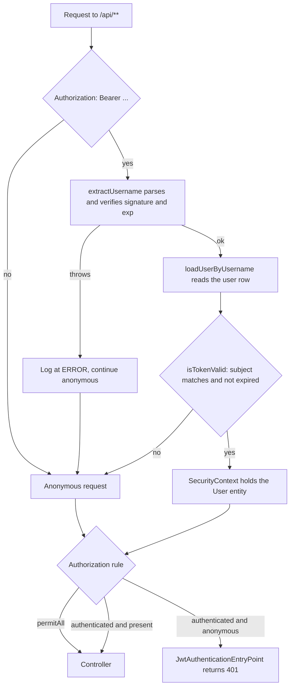

# Security and authentication

> **Audience:** Developers and operators working on the backend.  ·  **Scope:** The Spring Security filter chain, session and CORS policy, the JWT implementation, password handling, per-user isolation, and the security defects that exist today.

Job Tracker authenticates with a bearer JWT and enforces authorization entirely through per-user data scoping. There are no roles in use, no sessions, and no server-side token state. This page documents the mechanism exactly as it is implemented, including the places where it falls short.

## Contents

- [1. Request path and the filter chain](#1-request-path-and-the-filter-chain)
- [2. Session policy and CSRF](#2-session-policy-and-csrf)
- [3. CORS](#3-cors)
- [4. The JWT implementation](#4-the-jwt-implementation)
- [5. User details and password encoding](#5-user-details-and-password-encoding)
- [6. Per-user isolation](#6-per-user-isolation)
- [7. Known weaknesses](#7-known-weaknesses)
- [8. Implemented but unreachable](#8-implemented-but-unreachable)
- [See also](#see-also)

---

## 1. Request path and the filter chain

The backend runs under the context path `/api` (`src/main/resources/application.yml:4`, `src/main/resources/application-docker.yml:4`). Spring Security evaluates `requestMatchers` against the path with the context path already stripped, so the matcher `/v1/auth/**` matches the public URL `/api/v1/auth/**`.

The single `SecurityFilterChain` bean is defined at `src/main/java/com/nolcox/jobtracking/config/SecurityConfig.java:58-82`. Matchers are evaluated in source order and the first match wins.

**Table 1.** *Authorization rules in evaluation order, with the public URL each one covers and whether a controller backs it.*

| # | Line | Matcher | Methods | Rule | Public URL | Backed by a controller |
| --- | --- | --- | --- | --- | --- | --- |
| 1 | `:64` | `/v1/auth/**` | all | `permitAll` | `/api/v1/auth/**` | Yes: `POST /register` and `POST /login` only (`AuthController.java:26-38`) |
| 2 | `:66` | `/v1/config/**` | all | `permitAll` | `/api/v1/config/**` | Yes: `GET /statuses` and `GET /options` (`ConfigController.java:55,87`) |
| 3 | `:67` | `/api-docs`, `/api-docs/**`, `/swagger-ui/**`, `/swagger-ui.html` | all | `permitAll` | `/api/api-docs`, `/api/swagger-ui.html` | Yes, springdoc (`application.yml:39-43`) |
| 4 | `:68` | `/h2-console/**` | all | `permitAll` | `/api/h2-console/**` | No. See [section 7](#7-known-weaknesses) |
| 5 | `:69` | `/actuator/**` | all | `permitAll` | `/api/actuator/**` | Yes, Spring Boot Actuator |
| 6 | `:70` | `/public/**` | `GET` | `permitAll` | `GET /api/public/**` | No. No controller maps `/public` |
| 7 | `:71` | everything else | all | `authenticated` | | |

Rules 1 and 2 carry no `HttpMethod` argument, so they open every verb, not only the verbs the controllers implement. Since no other handler exists under those prefixes, other verbs return 404 or 405 rather than data.

The `/v1/config/**` exemption is deliberate. Those two endpoints return enum definitions (status labels, colors, groupings, and form option lists) and no user data. The comment at `SecurityConfig.java:65` records the intent, and `ConfigController` confirms it.

`JwtAuthenticationFilter` is registered before `UsernamePasswordAuthenticationFilter` (`SecurityConfig.java:79`). Its behavior for one request (`src/main/java/com/nolcox/jobtracking/infrastructure/security/JwtAuthenticationFilter.java:28-91`):

1. If the `Authorization` header is absent or does not start with the literal `Bearer ` (case sensitive, one space), the request continues unauthenticated (`:46-49`). The filter never writes a 401 itself.
2. Otherwise it strips the seven-character prefix (`:51`) and calls `jwtService.extractUsername(jwt)` (`:55`). This is where the signature and expiry are actually checked, because parsing verifies both.
3. It loads the user from the database by that email (`:61`). This happens on every authenticated request and is not cached.
4. It calls `jwtService.isTokenValid(jwt, userDetails)` (`:64`) and, on success, builds a `UsernamePasswordAuthenticationToken` from the loaded `UserDetails` and its authorities (`:67-71`), then places it in the `SecurityContext` (`:79`).
5. Everything from step 2 onward is wrapped in `catch (Exception e)` (`:86-88`). Any parse, signature, or expiry failure is logged at `ERROR` and the chain continues anonymously, so the request is rejected by the authorization rule rather than by the filter.

Rejection is rendered by `JwtAuthenticationEntryPoint` (`src/main/java/com/nolcox/jobtracking/infrastructure/security/JwtAuthenticationEntryPoint.java:26-43`), which sets status 401 and writes an `ApiErrorResponse` with the fixed message `You need to be authenticated to access this resource`. No `WWW-Authenticate` header is emitted. `accessDeniedHandler` is not customized, so a 403 raised inside the filter chain is shaped by Spring's default rather than by application code.



**Figure 1.** *How one request moves through the JWT filter and the authorization rules.*

One branch in the filter is unreachable. `JwtAuthenticationFilter.java:36-39` short-circuits when `request.getServletPath().contains("/api/auth")`, but `getServletPath()` returns the path with the `/api` context already removed, and the real route shape is `/v1/auth/...`. The condition can never be true at runtime. Public access to login and registration comes from rule 1 in Table 1, not from this branch.

---

## 2. Session policy and CSRF

Session creation is `STATELESS` (`SecurityConfig.java:73-75`). No `HttpSession` is created or read, no `SecurityContextRepository` persists anything between requests, and there is no remember-me or concurrent-session control. The `SecurityContext` is rebuilt from the token on every request.

CSRF protection is disabled (`SecurityConfig.java:61`). This is consistent with the design rather than an oversight: the credential is a bearer token held in `localStorage` and attached by an explicit Axios request interceptor (`frontend/src/services/api.js:16-22`), so no browser-managed cookie is sent automatically and a cross-site form post cannot carry a user's credential.

The trade-off is on the other side. Because the token is in `localStorage` (`frontend/src/context/AuthContext.js:20-21,37-38,56-57,71-72`), any script running on the origin can read it. No Content-Security-Policy is set anywhere in the repository, neither in `SecurityConfig` nor in `frontend/nginx.conf`. Combined with the absence of revocation (see [section 7](#7-known-weaknesses)), a successful XSS yields a token that stays valid until it expires.

`SecurityConfig` never calls `.headers(...)`, so Spring Security 6 default response headers apply unmodified, including `X-Content-Type-Options: nosniff` and `X-Frame-Options: DENY`. The nginx image that serves the built frontend adds `X-Frame-Options: SAMEORIGIN`, `X-Content-Type-Options: nosniff`, `X-XSS-Protection: 1; mode=block`, and `Referrer-Policy: strict-origin-when-cross-origin` (`frontend/nginx.conf:39-42`).

---

## 3. CORS

The CORS source is built in `SecurityConfig.corsConfigurationSource()` (`SecurityConfig.java:84-97`) and registered for all paths (`:95`):

```java
configuration.setAllowedOriginPatterns(Arrays.asList(corsAllowedOrigins.split(",")));
configuration.setAllowedMethods(Arrays.asList(
        "GET", "POST", "PUT", "PATCH", "DELETE", "OPTIONS"
));
configuration.setAllowedHeaders(List.of("*"));
configuration.setAllowCredentials(true);
```

Points worth knowing:

- `setAllowedOriginPatterns` is used, not `setAllowedOrigins`. Patterns are matched and the matching origin is echoed back, which is what makes `setAllowCredentials(true)` legal here.
- All request headers are allowed. `exposedHeaders` and `maxAge` are not set.
- `HEAD` is not in the allowed-methods list. `OPTIONS` is.
- `corsAllowedOrigins.split(",")` at `:87` does not trim. A configured value with a space after the comma produces a pattern with a leading space that will never match, so write the list with no whitespace.

The allowed origins come from the property `app.cors.allowed-origins`, which is set in several places depending on how you run the application.

**Table 2.** *Where the allowed CORS origins come from, and which source wins in each run mode.*

| Source | Value | Location |
| --- | --- | --- |
| Java field default, used only if the property is absent entirely | `http://localhost:3000,http://localhost:4200` | `SecurityConfig.java:44` |
| Default profile | `${CORS_ALLOWED_ORIGINS:http://localhost:3000,http://localhost:4200}` | `application.yml:36-37` |
| `docker` profile | `${CORS_ALLOWED_ORIGINS:http://localhost}` | `application-docker.yml:41-42` |
| Compose environment for the backend container | `${CORS_ALLOWED_ORIGINS:-http://localhost:3000}` | `docker-compose.yml:38` |
| Example environment file | `CORS_ALLOWED_ORIGINS=http://localhost:3000` | `.env.example:14` |

Under `docker compose up` the Compose environment variable wins, so the effective value is `http://localhost:3000`, which matches the port the frontend is published on (`docker-compose.yml:59-60`). The `http://localhost` default baked into `application-docker.yml:42` carries no port and therefore does not match that origin. It applies only if the image is run outside Compose with no `CORS_ALLOWED_ORIGINS` set.

> [!CAUTION]
> Do not set `CORS_ALLOWED_ORIGINS=*`. Because the configuration uses origin patterns together with `setAllowCredentials(true)`, a value of `*` produces a configuration that reflects any origin back and permits credentials, which Spring would have rejected at startup had `setAllowedOrigins` been used instead.

---

## 4. The JWT implementation

The library is jjwt 0.12.5 (`pom.xml:71-85`). All token work lives in `src/main/java/com/nolcox/jobtracking/infrastructure/security/JwtService.java`.

### Configuration

```java
@Value("${app.jwt.secret}")                       private String secretKey;       // :20-21
@Value("${app.jwt.expiration}")                   private long jwtExpiration;     // :23-24
@Value("${app.jwt.refresh-expiration:604800000}") private long refreshExpiration; // :26-27
```

Neither the secret nor the access-token lifetime has an inline default, so the application fails to start if the property is missing from configuration. Both are supplied by YAML in every profile, so this never fires in practice. `app.jwt.refresh-expiration` is not declared in any YAML file in the repository, so the inline default of seven days always applies.

### Creation and claims

Tokens are built in `JwtService.buildToken` (`JwtService.java:51-61`):

```java
Jwts.builder()
        .claims(extraClaims)
        .subject(userDetails.getUsername())
        .issuedAt(new Date(System.currentTimeMillis()))
        .expiration(new Date(System.currentTimeMillis() + expiration))
        .signWith(getSigningKey())
        .compact();
```

The subject is `User.getUsername()`, which returns the email (`domain/entity/User.java:70-73`). The extra claims come from `AuthServiceImpl.buildExtraClaims` (`application/service/impl/AuthServiceImpl.java:159-164`) and are exactly two: `userId` (the numeric id) and `role` (`USER` or `ADMIN`). Together with the registered claims the payload therefore carries `sub`, `iat`, `exp`, `userId`, and `role`.

There is no `iss`, no `aud`, no `nbf`, and no `jti`. The absence of `jti` matters: there is no per-token identity to revoke against.

### Signing

```java
private SecretKey getSigningKey() {
    byte[] keyBytes = Decoders.BASE64.decode(secretKey);
    return Keys.hmacShaKeyFor(keyBytes);
}
```

That is `JwtService.java:89-92`. The configured secret is interpreted as Base64, not as raw bytes and not as hex. `Keys.hmacShaKeyFor` then picks the HMAC variant from the decoded key length. The algorithm is never pinned anywhere in the code.

The committed default secret is 64 characters that decode to exactly 48 bytes, which is 384 bits, so **tokens are signed with HS384**, not HS256. This is confirmed by computation against the shipped secret.

> [!WARNING]
> The signing algorithm is a side effect of the secret's decoded length. A shorter secret silently downgrades the algorithm, and jjwt refuses to sign at all below 32 decoded bytes. If you replace `JWT_SECRET`, keep at least 48 decoded bytes to stay on HS384. `openssl rand -base64 48` gives exactly that. Older instructions suggested `openssl rand -hex 32`, whose 64 hexadecimal characters are themselves valid Base64 and decode to 48 bytes: the scheme works and yields an HS384 key, but it carries only the 256 bits of randomness behind the hex string rather than a full 384.

### Validation

Parsing and verification happen together in `extractAllClaims` (`JwtService.java:81-87`):

```java
Jwts.parser()
        .verifyWith(getSigningKey())
        .build()
        .parseSignedClaims(token)
        .getPayload();
```

Because a `SecretKey` is supplied rather than an algorithm name, jjwt rejects tokens whose header algorithm does not match the key type. Algorithm-confusion attacks and `alg: none` are therefore blocked by the library, not by application code. There is no explicit algorithm allow-list in this repository.

`isTokenValid` (`JwtService.java:63-66`) checks two things: that the token subject equals `userDetails.getUsername()`, and that the expiry has not passed. In the filter path the first check is a tautology, because the filter loaded that `UserDetails` using the token's own subject (`JwtAuthenticationFilter.java:55,61`). The second check is redundant too: jjwt's parser throws `ExpiredJwtException` before `isTokenExpired` runs, so an expired token produces an exception rather than a `false` return. No clock-skew allowance is configured.

`isTokenValid` does not consult `userDetails.isEnabled()`, and neither does the filter. See [section 7](#7-known-weaknesses).

### Lifetimes

**Table 3.** *Configured token lifetimes by profile.*

| Profile | Property | Value | Human | Location |
| --- | --- | --- | --- | --- |
| default | `app.jwt.expiration` | `${JWT_EXPIRATION:2592000000}` | 30 days | `application.yml:34` |
| `docker` | `app.jwt.expiration` | `86400000` literal, no placeholder | 1 day | `application-docker.yml:39` |
| `test` | `app.jwt.expiration` | `86400000` | 1 day | `src/test/resources/application-test.yml:26` |
| any | `app.jwt.refresh-expiration` | inline default only | 7 days | `JwtService.java:26` |

Because `application-docker.yml:39` is a literal, the `JWT_EXPIRATION` environment variable that `docker-compose.yml:37` passes into the backend container and that `.env.example:11` invites you to set has no effect under Compose. The lifetime is always one day there. The default profile honors the variable.

The value returned to the client in `AuthResponse.expiresIn` (`AuthServiceImpl.java:185`) is the configured lifetime in milliseconds, not an absolute expiry instant.

---

## 5. User details and password encoding

`CustomUserDetailsService` (`src/main/java/com/nolcox/jobtracking/infrastructure/security/CustomUserDetailsService.java:20-25`) is the whole implementation:

```java
@Override
@Transactional(readOnly = true)
public UserDetails loadUserByUsername(String username) throws UsernameNotFoundException {
    return userRepository.findByEmail(username)
            .orElseThrow(() -> new UsernameNotFoundException(
                    "User not found with email: " + username
            ));
}
```

The username is the email, and `email` is `@Column(unique = true, nullable = false)` on the entity (`domain/entity/User.java:31`). The JPA `User` entity implements `UserDetails` directly and is returned as-is, so the principal in the `SecurityContext` is a managed entity. `getAuthorities()` returns exactly one authority, `ROLE_USER` or `ROLE_ADMIN` (`User.java:65-68`). `isAccountNonExpired`, `isAccountNonLocked`, and `isCredentialsNonExpired` are not overridden, so the interface defaults of `true` apply. Lombok's `@Data` generates `isEnabled()` over the `boolean enabled` field (`User.java:48-49`).

Roles are effectively unused. `Role` has two constants (`domain/entity/Role.java`), self-registration hardcodes `Role.USER` (`AuthServiceImpl.java:56`), `RegisterRequest` has no role field, and nothing in the codebase ever creates or checks for `ADMIN`. `@EnableMethodSecurity` is switched on (`SecurityConfig.java:31`) but no `@PreAuthorize`, `@PostAuthorize`, `@Secured`, `hasRole`, or `hasAuthority` appears anywhere under `src/main`. Method security is inert, and the `role` claim in the token is informational.

Passwords are hashed with BCrypt at work factor 12 (`SecurityConfig.java:39,47-50`), above Spring Security's own default of 10. The bean is a bare `BCryptPasswordEncoder`, not a `DelegatingPasswordEncoder`, so stored hashes carry no `{bcrypt}` prefix and there is no migration path if the algorithm ever changes. Password length is validated at a minimum of 8 characters on registration (`RegisterRequest.java:21-23`) and, oddly, also on login (`AuthRequest.java:12-13`). There is no maximum, no complexity rule, and no breach-list check. There is no password change, reset, or forgot-password flow anywhere in the codebase, and no email verification step.

Login runs through the `AuthenticationManager` (`AuthServiceImpl.java:77-82`), which is the only path that performs the BCrypt comparison and the only path that runs Spring Security's account-status checks. There is no rate limiting, lockout, or CAPTCHA on `POST /api/v1/auth/login`. BCrypt cost 12 is the sole brute-force friction.

---

## 6. Per-user isolation

Authorization in this application means one thing: a user can only see and change rows that belong to them. There is no role check anywhere.

The user id comes from the authenticated principal, never from the request:

```java
private Long getUserIdFromAuthentication(Authentication authentication) {
    User user = (User) authentication.getPrincipal();
    return user.getId();
}
```

That is `src/main/java/com/nolcox/jobtracking/application/controller/JobApplicationController.java:516-519`, and every endpoint on that controller calls it. The principal is the entity that `JwtAuthenticationFilter.java:61` loaded from the database using the token's subject. The `userId` claim inside the token is never read for authorization: `JwtService.extractUserId` (`JwtService.java:33-36`) has no production caller. A forged `userId` claim, which would require the signing key in any case, could not select another user's rows.

Two enforcement patterns are in use.

**Queries scoped in SQL.** All list, count, and analytics endpoints go through repository methods that filter on the user id, for example `findByUserIdWithFilters` and `findAllByUserId` (`domain/repository/JobApplicationRepository.java`), and the event queries join through to the owner with `WHERE e.application.user.id = :userId` (`domain/repository/ApplicationEventRepository.java:123-124`). No endpoint accepts a `userId` parameter from the request.

**Load then assert.** Endpoints that take a path id load the row by id and then check ownership:

```java
private void assertUserOwnsApplication(JobApplication application, Long userId) {
    if (!application.getUser().getId().equals(userId)) {
        throw new UnauthorizedException("Access denied");
    }
}
```

The method exists twice, verbatim, at `application/service/impl/JobApplicationServiceImpl.java:411-415` and `application/service/impl/ApplicationEventServiceImpl.java:369-373`. It is called from `getApplication` (`JobApplicationServiceImpl.java:106`), `updateApplication` (`:168`), `deleteApplication` (`:260`), `updateApplicationStatus` (`:310`), and `getEventsForApplication` (`ApplicationEventServiceImpl.java:222`). Both copies use the string literal `"Access denied"` while `ErrorMessages.ACCESS_DENIED` exists (`shared/exception/ErrorMessages.java:38`) and is never referenced.

Nothing enforces the pattern structurally. There is no `@PostAuthorize`, no Hibernate filter, and no row-level security in the database. A new service that forgets to copy the check is a new insecure direct object reference, and the duplication makes that easy to do.

**Ownership failures return 403, not 404.** `getApplication` throws `ResourceNotFoundException` for an id that does not exist, which maps to 404 (`GlobalExceptionHandler.java:24-34`), and `UnauthorizedException` for an id that exists but belongs to someone else, which maps to 403 (`GlobalExceptionHandler.java:54-64`). The two responses are distinguishable, so an authenticated caller can walk the id space and learn which application ids exist across the whole installation, and roughly how many rows the system holds, without seeing any of their content. The same shape applies to `PUT /{id}`, `DELETE /{id}`, and `GET /{id}/events`. Returning 404 in both cases would close it. Note also that the class name reads backwards: `UnauthorizedException` maps to 403 Forbidden, which is the semantically correct status for an authenticated caller who is not permitted.

The frontend does not handle 403. Its Axios response interceptor clears the session and redirects only on 401 (`frontend/src/services/api.js:28-32`), so an ownership violation surfaces to the calling component unhandled.

---

## 7. Known weaknesses

These are real, present in the code as written, and each one is cited. They are recorded here rather than in a separate advisory because they are properties of the current design.

**Disabling an account does not cut off API access.** `JwtAuthenticationFilter` builds the `Authentication` object itself (`JwtAuthenticationFilter.java:64-71`) and never consults `userDetails.isEnabled()`. `JwtService.isTokenValid` (`JwtService.java:63-66`) checks only subject match and expiry. Spring Security's account-status checks run only on the login path through the `AuthenticationManager`. Setting `enabled = false` therefore blocks new logins but leaves every outstanding token fully functional until it expires, which is up to 30 days on the default profile.

**A disabled account's login attempt returns 500.** `AuthServiceImpl.authenticate` catches only `BadCredentialsException` (`AuthServiceImpl.java:95-100`). A `DisabledException` or `LockedException` from the `AuthenticationManager` falls through to the generic handler (`GlobalExceptionHandler.java:110-120`) and becomes a 500 with the body `An unexpected error occurred`. That is wrong on its own terms, and it is also a weak enumeration signal, since a 500 distinguishes a disabled account from a nonexistent one.

**There is no token revocation of any kind.** No denylist, no allowlist, no `jti`, no token-version column on `User`, no cache or Redis. Client-side logout removes the token from `localStorage` (`frontend/src/context/AuthContext.js:68-78`) and nothing more. Any copy of a token stays valid until `exp`. Rotating `JWT_SECRET` is the only revocation mechanism available, and it logs every user out at once.

**The H2 console rule is dead, but the fuse is live.** A `permitAll` matcher for `/h2-console/**` exists at `SecurityConfig.java:68`, and H2 ships in the built artifact at `runtime` scope (`pom.xml:64-68`). No runnable profile enables the console: `spring.h2.console.enabled` defaults to false, and the only occurrence of the property in the repository sets it explicitly to false under the test profile (`src/test/resources/application-test.yml:19-21`). Both runnable profiles point at MySQL. So the rule is unreachable today. It is still a landmine, because a single property flip during debugging would expose the H2 console unauthenticated at `/api/h2-console/**`, and that console accepts an arbitrary JDBC URL. The matcher should be deleted or scoped to a development-only profile.

**Registration discloses whether an email is registered.** A duplicate email throws `BusinessException(EMAIL_ALREADY_REGISTERED)` (`AuthServiceImpl.java:46-48`), which returns 400 with the message `Email is already registered`. An unauthenticated caller can distinguish registered from unregistered addresses. Login itself does not leak: both an unknown user and a wrong password return the same 401 with `Invalid email or password`.

**Ordinary token expiry logs at ERROR.** `JwtAuthenticationFilter.java:87` logs `Cannot set user authentication` at `ERROR` for any exception during parsing, which includes every expired token. Under the default profile `logging.level.org.springframework.security` is `DEBUG` (`application.yml:48`), compounding the noise. The `docker` profile tightens both (`application-docker.yml:59-63`).

**Committed secrets and a seeded account.** The default `JWT_SECRET` appears in `application.yml:33`, `application-docker.yml:38`, `docker-compose.yml:36`, and `.env.example:9`, and the default database credentials appear alongside them. `DataInitializer` is annotated `@Profile("!test")` (`config/DataInitializer.java:25`), so it runs under both runnable profiles and creates `test@example.com` with the password `password123`, logging the credentials in plaintext at `INFO` (`config/DataInitializer.java:51`). See [SECURITY.md](../../SECURITY.md) for the deployment consequences and the required remediation.

**Swagger UI is public on every profile.** `SecurityConfig.java:67` exempts `/api-docs` and `/swagger-ui.html` unconditionally, and springdoc is configured under both runnable profiles (`application.yml:39-43`, `application-docker.yml:44-48`). Any deployment publishes its full API surface without authentication.

**No pagination cap.** `Pageable` is bound straight from the request (`JobApplicationController.java:71`) with no `@PageableDefault` and no `spring.data.web.pageable.max-page-size` in any YAML, so only Spring Boot's own default cap applies. The frontend's `MAX_SIZE: 100` (`frontend/src/constants/api.js:41`) is a client-side constant that the backend does not know about.

**The `User` entity's generated `toString()` includes the password hash.** `@Data` on `User` (`domain/entity/User.java:21`) covers every field, including `password` (`:35-36`), with no `@ToString.Exclude`. Nothing in `src/main` currently logs the whole entity, but any future `log.info("{}", user)` would print the hash.

---

## 8. Implemented but unreachable

> [!NOTE]
> **Status: not wired.** `AuthService.refreshToken(String)` and `AuthService.logout(String)` are declared on the interface (`application/service/AuthService.java:30,37`) and implemented in `AuthServiceImpl` (`:103-131` and `:133-148`), but `AuthController` exposes only `/register` and `/login` (`application/controller/AuthController.java:26-38`). Neither implementation has a route, so no request can reach either one.
>
> Both would need work before they were wired up. `logout` clears `SecurityContextHolder`, which under the stateless policy is per-request thread state, so it revokes nothing; its own comments (`AuthServiceImpl.java:144-147`) say a denylist would be required. `refreshToken` accepts an ordinary access token as a refresh token, since it only calls `isTokenValid` and no claim distinguishes the two token types, and its `catch (Exception e)` at `:127-130` swallows the more specific `INVALID_REFRESH_TOKEN` thrown at `:117`.

The frontend already calls `POST /api/v1/auth/logout` (`frontend/src/services/api.js:41`, endpoint constant at `frontend/src/constants/api.js:18`). That request 404s and the error is deliberately ignored (`frontend/src/context/AuthContext.js:74-77`).

Other dead security code worth knowing about when reading the codebase: the `/public/**` matcher with no controller behind it (`SecurityConfig.java:70`), the unreachable auth-path branch in the filter (`JwtAuthenticationFilter.java:36-39`), `JwtService.extractUserId` and `JwtService.generateRefreshToken` with no production callers, and `ErrorMessages.ACCESS_DENIED` unused while two call sites hardcode the same string.

---

## See also

- [Security policy](../../SECURITY.md) for what to report and what is known by design.
- [API reference](./03-api-reference.md) for the endpoints these rules protect and their error shapes.
- [Configuration](./08-configuration.md) for the full property and environment-variable inventory.
- [Known gaps](./11-known-gaps.md) for defects outside the security area.

*Documentation current as of Job Tracker 2.1.0 (August 2026). Source of truth is the code; report drift as an issue.*
