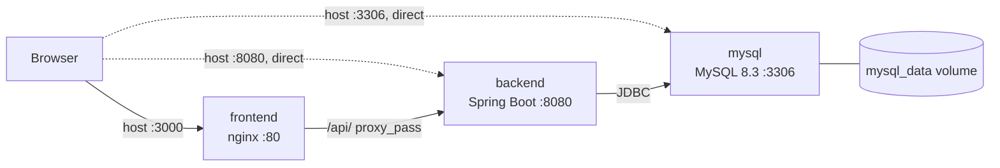

# Deployment and operations

> **Audience:** Anyone running Job Tracker outside their IDE.  ·  **Scope:** The Compose stack service by service, both Dockerfiles, nginx, actuator exposure, schema management, on-disk state, and what a first run actually looks like.

Job Tracker ships one deployment artifact: a three-service Docker Compose stack built from source on the machine that runs it. This page describes what that stack does, what it exposes, what it persists, and where it will surprise you.

## Contents

- [1. What this stack is built for](#1-what-this-stack-is-built-for)
- [2. The Compose stack](#2-the-compose-stack)
- [3. The backend image](#3-the-backend-image)
- [4. The frontend image and nginx](#4-the-frontend-image-and-nginx)
- [5. Actuator exposure](#5-actuator-exposure)
- [6. Schema management and upgrades](#6-schema-management-and-upgrades)
- [7. State on disk, and what is lost](#7-state-on-disk-and-what-is-lost)
- [8. First run, step by step](#8-first-run-step-by-step)
- [9. Running a second instance](#9-running-a-second-instance)
- [10. What is not here](#10-what-is-not-here)
- [See also](#see-also)

---

## 1. What this stack is built for

Local use, on a machine you control, by one person.

- **There is no TLS anywhere.** nginx serves plain HTTP on container port 80 (`frontend/nginx.conf:33`), the backend serves plain HTTP on 8080, and the JDBC URL sets `useSSL=false` (`docker-compose.yml:33`). It also sets `allowPublicKeyRetrieval=true`, which MySQL 8's `caching_sha2_password` needs over an unencrypted connection but which weakens the handshake against an active attacker.
- **Every service publishes a port on the host**, including MySQL on 3306 (`docker-compose.yml:12`). Nothing in the application needs that published port; the backend reaches MySQL over the Compose network as `mysql:3306`. Publishing it means the database is reachable from outside the Compose network with the default credentials.
- **A demo account is seeded by default.** `DataInitializer` is annotated `@Profile("!test")` (`src/main/java/com/nolcox/jobtracking/config/DataInitializer.java:25`), so it runs under both the default and the `docker` profiles. Every `docker compose up` creates `test@example.com` with the password `password123` if it does not already exist, then five sample applications, and logs the credentials in plaintext at INFO (`DataInitializer.java:51`, `:157`).
- **Every default is committed.** Because every Compose variable reference carries a `:-` fallback, `docker compose up` works with no `.env` file at all, using the shipped JWT secret and the shipped database passwords.

> [!CAUTION]
> Do not put this stack on a public network as shipped. No TLS, MySQL published on the host with the credentials `jobtracker` / `jobtracker123` (and `root` / `rootpassword`), Swagger UI publicly reachable, and a known-credential demo account created on every start. Each of those is a deliberate convenience for a local demo and a genuine exposure anywhere else.

---

## 2. The Compose stack

`docker-compose.yml` has no top-level `version:` key; it starts at `services:` (`docker-compose.yml:1`), which requires Compose v2.



**Figure 1.** *The three Compose services. Solid arrows are the paths the application uses; dotted arrows are published host ports that nothing in the application needs.*

### mysql

**Table 1.** *The `mysql` service.*

| # | Aspect | Value | Source |
| - | ------ | ----- | ------ |
| 1 | Image | `mysql:8.3.0` | `docker-compose.yml:3` |
| 3 | Restart policy | `unless-stopped` | `:5` |
| 4 | Environment | `MYSQL_ROOT_PASSWORD`, `MYSQL_DATABASE`, `MYSQL_USER`, `MYSQL_PASSWORD` | `:6-10` |
| 5 | Ports | `3306:3306` | `:12` |
| 6 | Volumes | `mysql_data` at `/var/lib/mysql`; bind mount `./src/main/resources/database/job_tracking_db_1.sql` at `/docker-entrypoint-initdb.d/init.sql:ro` | `:14-15` |
| 7 | Healthcheck | `["CMD", "mysqladmin", "ping", "-h", "localhost", "-u", "root", "-p${MYSQL_ROOT_PASSWORD:-rootpassword}"]` | `:17` |
| 8 | Healthcheck timings | interval 10s, timeout 5s, retries 5, start period 30s | `:18-21` |
| 9 | Network | `jobtracking-network` | `:22-23` |

Two notes on row 7. The root password is interpolated into the healthcheck argv, so it is visible in `docker inspect` and in the container's process list. And `mysqladmin ping` reports success even when the credentials are rejected, so this check proves the server is answering, not that it is usable. That is usually what you want for a `depends_on` gate.

The init script mount (row 6) lands in `/docker-entrypoint-initdb.d/`, which the official MySQL entrypoint executes **only when `/var/lib/mysql` is empty**, that is, only on the very first start against a fresh `mysql_data` volume. After that the file is inert, and edits to `job_tracking_db_1.sql` do nothing until you `docker compose down -v`. The script contains no `CREATE DATABASE` and no `USE`; it relies on the entrypoint running init scripts against `$MYSQL_DATABASE`.

### backend

**Table 2.** *The `backend` service.*

| # | Aspect | Value | Source |
| - | ------ | ----- | ------ |
| 1 | Build | context `.`, dockerfile `Dockerfile` | `docker-compose.yml:26-28` |
| 3 | Restart policy | `unless-stopped` | `:30` |
| 4 | Environment | `SPRING_PROFILES_ACTIVE` (inert), `SPRING_DATASOURCE_URL`, `SPRING_DATASOURCE_USERNAME`, `SPRING_DATASOURCE_PASSWORD`, `JWT_SECRET`, `JWT_EXPIRATION` (inert), `CORS_ALLOWED_ORIGINS` | `:31-38` |
| 5 | Ports | `8080:8080` | `:39-40` |
| 6 | depends_on | `mysql` with `condition: service_healthy` | `:41-43` |
| 7 | Healthcheck | `["CMD", "curl", "-f", "http://localhost:8080/api/actuator/health"]` | `:45` |
| 8 | Healthcheck timings | interval 30s, timeout 10s, retries 3, start period 60s | `:46-49` |
| 9 | Network | `jobtracking-network` | `:50-51` |
| 10 | Volumes | none | |

Row 6 is the piece that matters most for correctness. `condition: service_healthy` is what prevents the classic race where the backend starts before MySQL is accepting connections.

Two of the variables in row 4 do nothing. `SPRING_PROFILES_ACTIVE` is overridden by the image entrypoint, and `JWT_EXPIRATION` is not read under the `docker` profile. Both are covered in [8. Configuration](./08-configuration.md).

The Compose healthcheck duplicates the image's own `HEALTHCHECK` (`Dockerfile:40-41`) with an identical command and identical timings. The Compose definition wins.

### frontend

**Table 3.** *The `frontend` service.*

| # | Aspect | Value | Source |
| - | ------ | ----- | ------ |
| 1 | Build | context `./frontend`, dockerfile `Dockerfile` | `docker-compose.yml:54-56` |
| 3 | Restart policy | `unless-stopped` | `:58` |
| 4 | Ports | `3000:80`, host 3000 to container 80 | `:59-60` |
| 5 | depends_on | `- backend`, plain list form, **no condition** | `:61-62` |
| 6 | Healthcheck | `["CMD", "curl", "-f", "http://localhost/health"]` | `:64` |
| 7 | Healthcheck timings | interval 30s, timeout 10s, retries 3, start period 10s | `:65-68` |
| 8 | Network | `jobtracking-network` | `:69-70` |
| 9 | Environment, volumes | none | |

Row 5 is start-order only, not health. nginx starts happily without the backend, and API calls return 502 until the backend answers. Given the backend's 60 second start period, the UI is reachable and non-functional for roughly the first minute of a cold start.

### Volume and network

`mysql_data` uses the `local` driver (`docker-compose.yml:72-74`). `jobtracking-network` is a bridge network (`:76-78`) that all three services join, so they resolve each other by service name: `mysql`, `backend`, `frontend`.

---

## 3. The backend image

`Dockerfile` is a two-stage build.

Stage 1, the builder (`Dockerfile:2-12`):

```dockerfile
FROM maven:3.9-eclipse-temurin-17 AS builder
WORKDIR /app
COPY pom.xml .
RUN mvn dependency:go-offline -B
COPY src src
RUN mvn clean package -DskipTests -B
```

Copying `pom.xml` alone and resolving dependencies before the source arrives gives a cacheable dependency layer, so editing Java code does not re-download the world. `mvn clean` deletes `/app/target` but not the `~/.m2` cache, so that layer still pays off.

Tests are skipped in the image build, and they have to be: `.dockerignore:47` excludes `src/test/`, so the test sources are not in the build context at all. `.dockerignore` also excludes `target/`, `frontend/`, `.git/`, `.env` and `.env.*` (keeping `.env.example`), and all `*.md` except `README.md`.

Stage 2, the runtime (`Dockerfile:15-44`):

- `FROM eclipse-temurin:17-jre`, a Debian-based image, not pinned to a patch tag.
- `curl` is installed purely so the healthcheck can run (`Dockerfile:20`).
- A non-root user is created and used: `groupadd -g 1001 appgroup && useradd -u 1001 -g appgroup -s /bin/bash appuser` (`:23-24`), `chown -R appuser:appgroup /app` (`:31`), `USER appuser` (`:34`).
- The jar is copied by glob: `COPY --from=builder /app/target/jobtracking-*.jar app.jar` (`:28`). The comment at `:26-27` explains why: the image does not need editing when the project version changes in `pom.xml`. The tradeoff is that a build producing two matching jars would fail, because `COPY` with a glob to a single-file destination cannot resolve.
- `EXPOSE 8080` (`:37`), then the healthcheck at `:40-41` and the entrypoint at `:44`.

```dockerfile
ENTRYPOINT ["java", "-jar", "app.jar", "--spring.profiles.active=docker"]
```

The profile is baked into the entrypoint, which makes this a docker-profile-only image. Switching profiles requires replacing the container command, not setting an environment variable.

There are no JVM memory flags and no `-XX:MaxRAMPercentage`, so the JVM uses its default container heuristic. On a small container that is conservative.

---

## 4. The frontend image and nginx

`frontend/Dockerfile` is also two stages.

Stage 1 (`frontend/Dockerfile:2-16`) builds on `node:22-alpine`, copies `package*.json`, runs `npm install` (`:10`), then copies the source and runs `npm run build` into `/app/build`. Note that this is `npm install`, not `npm ci`, so the lockfile is not enforced even though `package-lock.json` exists and CI uses `npm ci` (`.github/workflows/ci.yml:53`). Image builds are not reproducible against the lockfile.

Stage 2 (`frontend/Dockerfile:19-43`) starts from `nginx:1.25-alpine` and:

- Copies `nginx.conf` to `/etc/nginx/nginx.conf` (`:22`), replacing the whole main configuration rather than adding a drop-in under `conf.d`. `frontend/.dockerignore` deliberately does not exclude `nginx.conf`, which this `COPY` requires.
- Copies the built bundle to `/usr/share/nginx/html` (`:25`).
- Creates a non-root user and chowns what nginx writes to: the html root, `/var/cache/nginx`, `/var/log/nginx`, and a touched `/var/run/nginx.pid` (`:28-34`), then `USER appuser` (`:37`).
- `EXPOSE 80` (`:40`) and `CMD ["nginx", "-g", "daemon off;"]` (`:43`).

Binding port 80 as UID 1001 works under modern Docker, which sets `net.ipv4.ip_unprivileged_port_start=0` inside containers. Under older Docker, rootless podman without that sysctl, or a restrictive Kubernetes `securityContext`, this container will fail to bind. A port above 1024 would be more portable.

`frontend/nginx.conf` has no `user` directive, which is correct for a container that already sets `USER`.

### The API proxy

```nginx
location /api/ {
    proxy_pass http://backend:8080/api/;
    proxy_http_version 1.1;
    proxy_set_header Host $host;
    proxy_set_header X-Real-IP $remote_addr;
    proxy_set_header X-Forwarded-For $proxy_add_x_forwarded_for;
    proxy_set_header X-Forwarded-Proto $scheme;
    proxy_connect_timeout 60s;
    proxy_send_timeout 60s;
    proxy_read_timeout 60s;
}
```

That is `frontend/nginx.conf:45-55`. The `proxy_pass` target has a URI part (`/api/`), so nginx strips the matched prefix and re-prepends it, leaving the path unchanged. A browser request to `/api/v1/job-applications` reaches the backend as `/api/v1/job-applications`, which lands inside the backend's `/api` context path.

Two operational consequences. The 60 second read timeout is the effective ceiling for any slow endpoint. And because the upstream is referenced literally with no `resolver` directive, nginx resolves `backend` once at startup; if the backend container is recreated with a different IP, nginx keeps using the stale address until it is reloaded or restarted. Restart the frontend container after a `docker compose up -d backend` style redeploy.

### SPA fallback

```nginx
location / {
    try_files $uri $uri/ /index.html;
}
```

`frontend/nginx.conf:58-60`. Any path that does not match a file on disk serves `index.html`, so React Router client-side routes such as `/dashboard` and `/settings` survive a hard refresh. Because `location /api/` is a longer prefix match, API paths never fall through to `index.html`.

Static assets matching `\.(js|css|png|jpg|jpeg|gif|ico|svg|woff|woff2|ttf|eot)$` get `expires 1y` and `Cache-Control: public, immutable` (`:63-66`). That is safe because Create React App content-hashes its bundles. `index.html` is not matched by that pattern, so it is not cached for a year.

### Health endpoint

```nginx
location /health {
    access_log off;
    return 200 "healthy\n";
    add_header Content-Type text/plain;
}
```

`frontend/nginx.conf:69-73`. This is a static literal. It does not check the backend and it does not check that the SPA bundle is present, so a frontend container serving an empty document root still reports healthy.

### Security headers

Four headers are set at server level with `always`: `X-Frame-Options: SAMEORIGIN`, `X-Content-Type-Options: nosniff`, `X-XSS-Protection: 1; mode=block`, and `Referrer-Policy: strict-origin-when-cross-origin` (`frontend/nginx.conf:39-42`). There is no Content-Security-Policy and no HSTS, the latter being moot without TLS.

nginx `add_header` directives do not merge across levels: a location that declares its own `add_header` discards the ones inherited from the server block. Both the static-asset location (`:63-66`) and the `/health` location (`:69-73`) declare their own, so those four security headers are not emitted on static JavaScript, CSS, image or font responses.

---

## 5. Actuator exposure

Actuator is on the classpath in every profile (`pom.xml:50`), and `SecurityConfig.java:69` permits `/actuator/**` without authentication.

**Table 4.** *Actuator endpoints reachable per profile. All paths carry the `/api` context prefix.*

| # | Profile | Exposed | Health detail | Effect |
| - | ------- | ------- | ------------- | ------ |
| 1 | default | `health` only (Spring Boot default) | `never` (default) | `GET /api/actuator/health` returns `{"status":"UP"}` |
| 2 | `docker` | `health,info` (`application-docker.yml:54`) | `when-authorized` (`:57`) | Health as above. `GET /api/actuator/info` returns `{}` |
| 3 | `test` | `health` only | `never` | Same as the default profile |

Both of the docker profile's management settings are effectively no-ops. `when-authorized` combined with anonymous access means there is never an authorized principal, so details are never shown; the setting behaves as `never`. And `info` returns an empty object because no `InfoContributor` bean exists and the Maven plugin does not generate `build-info.properties`.

The blast radius today is small, since only health and an empty info document are exposed. The pattern is the risk: anything added to the include list becomes publicly readable without further change.

---

## 6. Schema management and upgrades

There is no migration tool. No Flyway, no Liquibase, nothing in `pom.xml`. Schema management is Hibernate's `ddl-auto`.

**Table 5.** *`ddl-auto` per profile and what it does.*

| # | Profile | Value | Source | Behavior |
| - | ------- | ----- | ------ | -------- |
| 1 | default | `update` | `src/main/resources/application.yml:23` | Hibernate compares the entity model to the live schema at startup and issues additive DDL only |
| 2 | `docker` | `update` | `src/main/resources/application-docker.yml:28` | Same. This is what the Compose stack runs |
| 3 | `test` | `none` | `src/test/resources/application-test.yml:11` | Hibernate issues no DDL; the schema comes from `src/test/resources/schema.sql` via `spring.sql.init` (`:14-17`) |

The checked-in MySQL init script is behind the entity model. `src/main/resources/database/job_tracking_db_1.sql` creates `job_applications` without a `level` column, while the entity declares `@Column(name = "level")` (`src/main/java/com/nolcox/jobtracking/domain/entity/JobApplication.java:72-73`) and the test schema has it (`src/test/resources/schema.sql:28`). On a fresh volume, MySQL runs the stale script, then Hibernate adds the missing column at startup because `ddl-auto: update` is on. The gap self-heals, and only because of that setting. Load that script and start with `ddl-auto: validate` or `none` and startup fails.

The two schema files diverge in other ways too. The MySQL script adds `INDEX idx_email`, `INDEX idx_user_status (user_id, status)`, `INDEX idx_applied_date`, `INDEX idx_application_events (application_id, created_at)`, `ENGINE=InnoDB DEFAULT CHARSET=utf8mb4`, `ON DELETE CASCADE` foreign keys, and `ON UPDATE CURRENT_TIMESTAMP` columns. The H2 test schema has none of the indexes and uses `TIMESTAMP` where MySQL uses `DATETIME`. See [2. Domain and persistence](./02-domain-and-persistence.md).

> [!IMPORTANT]
> `update` is additive only. It never drops a column, never renames one, never narrows a type and never adds a `NOT NULL` constraint to an existing column. Removing a field from an entity leaves the column in place; renaming a field creates a new column and orphans the old one. Downgrades have no reverse path: rolling back to an older jar leaves the newer columns present. And two backend replicas starting at once would both attempt DDL with no locking, so this is a single-instance deployment.

Treat the JPA entities as the single source of truth for the schema. `job_tracking_db_1.sql` is not a migration; it runs once, only on an empty volume, and is already stale.

To upgrade, back up first, because nothing in the repository does it for you:

```bash
# Back up the MySQL volume to a tarball in the current directory.
docker run --rm -v jobtracking_mysql_data:/v -v "$PWD":/b alpine \
  tar czf /b/mysql-backup.tgz /v

# Rebuild and restart.
docker compose up --build -d
```

Confirm the real volume name with `docker volume ls` before running that first command; Compose prefixes it with the project name. A `mysqldump` through the published port 3306 works equally well.

---

## 7. State on disk, and what is lost

**Table 6.** *Where state lives and what survives each teardown.*

| # | State | Where it lives | Survives `docker compose down` | Survives `docker compose down -v` |
| - | ----- | -------------- | ------------------------------ | --------------------------------- |
| 1 | Users, job applications, application events | Named volume `mysql_data` at `/var/lib/mysql` (`docker-compose.yml:14`) | Yes | **No, permanently destroyed** |
| 2 | Backend state | None. Container filesystem only | n/a | n/a |
| 3 | Frontend state | None. Static files baked into the image | n/a | n/a |
| 4 | Logs | Container stdout via the Docker log driver, plus `/var/log/nginx/*.log` inside the frontend container's writable layer | Lost when containers are removed | Lost |
| 5 | Issued JWTs | Not stored server-side at all; they are stateless HMAC | Tokens stay valid across restarts as long as `JWT_SECRET` is unchanged | Same |
| 6 | Browser session | `localStorage` keys `token` and `user` (`frontend/src/constants/api.js:47-48`) | Client-side only, unaffected | Unaffected |

There is no log persistence. Nothing writes to a file appender, there is no logback configuration and no rotation, so a container's history is whatever the Docker json-file driver retained.

If `mysql_data` is removed, the next start re-initializes MySQL from scratch, re-runs the init script, and `DataInitializer` recreates the demo user and its five sample applications. Real accounts and real applications are gone with no recovery path.

---

## 8. First run, step by step

From a clean checkout with no `.env`:

```bash
docker compose up --build
```

What to expect, in order:

1. **Builds.** Both images build from source. The first backend build downloads the full Maven dependency tree; the first frontend build runs `npm install` and a Create React App production build. Expect several minutes.
2. **MySQL starts first.** Its healthcheck has a 30 second start period and a 10 second interval (`docker-compose.yml:18-21`). On the very first start only, the entrypoint executes `/docker-entrypoint-initdb.d/init.sql`.
3. **The backend waits.** `condition: service_healthy` (`:41-43`) holds it until MySQL passes.
4. **The frontend does not wait.** `depends_on: - backend` carries no condition (`:61-62`), so nginx is serving on host port 3000 almost immediately. API calls return 502 until the backend is up, so the UI is reachable and broken for roughly the first minute.
5. **Hibernate reconciles the schema.** `ddl-auto: update` adds anything the init script missed, including the `level` column.
6. **The demo account is created.** The log prints `Created default test user: test@example.com / password123` (`DataInitializer.java:51`) and then `Created 5 sample job applications for test user` (`:157`).
7. **The stack is ready.** Log in at `http://localhost:3000` with `test@example.com` / `password123`.

**Table 7.** *Effective endpoints once the stack is up.*

| # | What | URL from the host | Notes |
| - | ---- | ----------------- | ----- |
| 1 | UI | `http://localhost:3000` | nginx, container port 80 |
| 2 | API through the UI origin | `http://localhost:3000/api/v1/...` | Proxied to `backend:8080`, same origin |
| 3 | API direct | `http://localhost:8080/api/v1/...` | Published backend port, subject to CORS |
| 4 | Swagger UI | `http://localhost:8080/api/swagger-ui.html` | Public, no authentication |
| 5 | OpenAPI JSON | `http://localhost:8080/api/api-docs` | Public, no authentication |
| 6 | Backend health | `http://localhost:8080/api/actuator/health` | Public, `{"status":"UP"}`, details suppressed |
| 7 | Backend info | `http://localhost:8080/api/actuator/info` | `docker` profile only, returns `{}` |
| 8 | Frontend health | `http://localhost:3000/health` | Static `healthy`, checks nothing |
| 9 | MySQL | `localhost:3306` | Published, default credentials |

One thing to expect on that first dashboard load: `GET /api/v1/job-applications/analytics/stage-durations` returns 500 against the seeded demo data. `DataInitializer` builds entities directly rather than through the service layer and never sets `statusChangedAt`, while seeding non-`APPLIED` statuses, and `AnalyticsServiceImpl.getStageDurations` dereferences that field without a null guard. Applications created through the UI are unaffected, because the write path always populates it. The other eleven analytics endpoints return 200. See [11. Known gaps](./11-known-gaps.md) and [6. Troubleshooting](../user-guide/06-troubleshooting.md).

---

## 9. Running a second instance

You cannot, without editing the file.

No service sets `container_name`, so Compose derives container names from the project name and a second copy of the stack can run alongside the first. Until 1.3.2 the names were pinned, which made `docker compose -p other up` fail with a name conflict.

> [!WARNING]
> `docker compose -p other up` gives you a second instance only if you also override the published host ports. 3000, 8080 and 3306 are fixed in the file and collide between copies.

The workaround is to remove the three `container_name:` lines and change the three port mappings, then run each instance under its own project name:

```bash
# In your copy of docker-compose.yml: delete the container_name lines and
# change the host side of each port mapping, for example 3001:80, 8081:8080,
# 3307:3306. Then:
docker compose -p jobtracking-two up -d
```

Compose then generates names of the form `<project>-<service>-1`, and the volume and network are project-scoped already, so the two instances get separate databases. If you change the frontend's published port, also update `CORS_ALLOWED_ORIGINS` for consistency, even though the proxied topology never consults it. See [8. Configuration](./08-configuration.md).

---

## 10. What is not here

Stated plainly, so nobody goes looking:

- **No deployment automation.** CI (`.github/workflows/ci.yml`) runs a backend job and a frontend job. It builds no Docker image, publishes nothing and deploys nowhere. Deployment is a manual `docker compose up --build` on the target machine.
- **No backups.** Nothing in the repository snapshots the volume or dumps the database.
- **No resource limits.** No `mem_limit` and no `cpus` on any service.
- **No secrets management.** Secrets are plain environment variables with committed defaults, and the MySQL root password appears in the healthcheck argv.
- **No horizontal scaling.** `ddl-auto: update` with no locking makes this single-instance by construction.
- **No log aggregation or rotation.** Everything goes to stdout.

Report anything here that has drifted from the code as an issue. Security-relevant findings go through [SECURITY.md](../../SECURITY.md) instead.

---

## See also

- [8. Configuration](./08-configuration.md) for every property and environment variable, including the ones that do nothing.
- [4. Security and authentication](./04-security-and-authentication.md) for the filter chain, public paths and token handling.
- [2. Domain and persistence](./02-domain-and-persistence.md) for the entity model the schema is derived from.
- [11. Known gaps](./11-known-gaps.md) for the running defect list, including the first-run analytics 500.
- [1. Getting started](../user-guide/01-getting-started.md) for the shortest path to a running instance.

---

*Documentation current as of Job Tracker 1.3.1 (August 2026). Source of truth is the code; report drift as an issue.*
